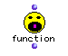

OM User's Manual  
---  
[Prev](funcref.intro)| | [Next](funcref.omloop)  
  
* * *

# the exact name of the function

  

## Name

the exact name of the function, (the OM module containing the function) \-- a
brief description of what the function does  

## Syntax

(the traditional lisp syntax summary)

`` **a sample function**` the first input &optional a second input a third
input &rest a fourth input `

the lisp syntax summary indicates at a glance the structure of the function.
The function name is given followed by the names of the inputs, which
sometimes have prefixes beginning with the & character. In this case, our
sample function has four inputs. The first input has no prefix; this signifies
that the input is always present.

The second input is preceded by `_& optional_`. This means that the input is
optional; an optional input is hidden when the function first appears in the
workspace. Optional inputs are added by clicking the function icon once, then
holding option and hitting the right arrow. This can be undone by holding
option and hitting the left arrow.

The third input does not have the &optional designation. However, since it
follows one that does, it too is optional. **Inputs that follow an input with
&optional are also optional.**

The fourth input has a different prefix, &rest. This prefix means that the
input is optional and repeatable- by repeating the option-left-arrow
combination but you can add as many of that kind of input as you want.

## Inputs

(the inputs are discussed in detail here, one by one)

name| data type(s)| comments  
---|---|---  
` _the name of the input, as listed in the syntax summary_`|  the data type(s)
accepted at this input| any relevant comments about this input, including
whether it is optional, and the default value  
  
## Output

(here, a similar discussion of the outputs of a function)

output| data type(s)| comments  
---|---|---  
the number of the output (some functions don't have names for their outputs,
in which case the outputs will be listed by number.| the data type(s) returned
by the function| what the output is  
  
## Description

Here you will find an in-depth description of the function.

## Examples

 **Example 1. An example of the function**

Some function pages have an example section to demonstrate the function in
action. It usually includes screenshots.

* * *

[Prev](funcref.intro)| [Home](index)| [Next](funcref.omloop)  
---|---|---  
Using the Function Reference| [Up](funcref.intro)| `omloop` and
Components Reference

