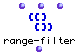

OpenMusic Reference  
---  
[Prev](prime-ser)| | [Next](reduce-tree)  
  
* * *

# range-filter

  
  
range-filter  
  
(lists module) \-- Filters elements of a tree based on their ordinal position  

## Syntax

   **range-filter**  list posn mode  

## Inputs

name| data type(s)| comments  
---|---|---  
_list_ |  a tree| the tree to filter  
_posn_ |  a list of pairs ofnumbers| must contain at least one pair of numbers, for example ((1 3))  
_mode_ |  menu| two options: pass and reject. Defaults to 'reject'  
  
## Output

output| data type(s)| comments  
---|---|---  
first| a tree|  
  
## Description

 range-filter  passes or rejects all elements from  _list_  that fall within
the range of positions specified in  _posn_ . Multiple ranges of positions can
be specified in the form of additional pairs of numbers as sublists of
 _posn_ . Even if there is only one range, it must be given as a sublist of
 _posn_  , which must thus have two levels of parentheses. Each pair of
numbers defines a range of positions, counting from zero (as usual).

If mode is set to  _pass_  , only elements within one of these ranges are
passed. If mode is set to  _reject_  , elements falling within any one of
these intervals are suppressed.

|

If you are looking to filter ranges of elements in a list based on their
numerical value rather than their position in the list, use [ band-
filter ](band-filter)  
  
---|---  
  
## Examples

### Filtering a range of positions from a list

Mode is set to  _pass_  , so only the elements in between positions 0-1 and
4-5, inclusive, will be passed. Sublists are treated as single elements:

 ? OM->((1 (2 3) (a b) 8) 

Reversing the mode will cause only elements outside of those intervals to be
passed, namely, positions 2 and 3:

 ? OM->(5 7) 

* * *

[Prev](prime-ser)| [Home](index)| [Next](reduce-tree)  
---|---|---  
prime-ser| [Up](funcref.main)| reduce-tree

