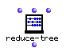

OpenMusic Reference  
---  
[Prev](range-filter)| | [Next](remove)  
  
* * *

# reduce-tree

  
  
reduce-tree  
  
(arithmetic module) \-- applies a commutative binary function throughout a
tree  

## Syntax

   **reduce-tree**  self function &optional accum  

## Inputs

name| data type(s)| comments  
---|---|---  
  _self_ |  a list|  
  _function_ |  a function or patch in lambda mode| the operation to perform
across  _self_ . Defaults to '+'  
  _accum_ |  a number| optional; the identity element for the function
 _function_   
  
## Output

output| data type(s)| comments  
---|---|---  
first| a number| returns the result of  _function_  performed throughouut the
tree  
  
## Description

Applies a function across all the elements of a tree. A pair of elements of
the tree is passed to  _function_  ; the result is paired with the next
element and they are passed again to  _function_  until the tree has been
totally 'reduced.' For example, the tree (1 8 2) passed with the function  + 
will yield 11 since 1+8+2=11. The same list passed with  *  will yield 16
since 1*8*2=16.

  _function_  can be any commutative function with two inputs. The optional
input is the identity element for the operation being performed.  reduce-tree 
is smart enough to figure it out for the basic functions  * ,  + ,  min ,
 max .

|

Commutative functions are functions which yield the same result regardless of
the order of the inputs. Addition is a commutative function since 3+2 and 2+3
both equal 5. Subtraction is _not_ a commutative function. Using  reduce-tree 
with non-commutative functions will produce unpredictable results  
  
---|---  
  
* * *

[Prev](range-filter)| [Home](index)| [Next](remove)  
---|---|---  
range-filter| [Up](funcref.main)| remove

