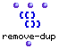
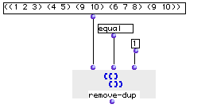
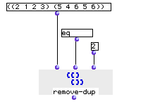

OpenMusic Reference  
---  
[Prev](remove)| | [Next](removetemporalbox)  
  
* * *

# remove-dup

  
  
remove-dup  
  
(lists module) \-- returns list without repetitions  

## Syntax

   **remove-dup**  list test depth  

## Inputs

name| data type(s)| comments  
---|---|---  
  _list_ |  a tree or a list|  
  _test_ |  a symbol or lambda function| defaults to  eq   
  _depth_ |  a non-zero integer| defaults to 1  
  
## Output

output| data type(s)| comments  
---|---|---  
first| a tree or list|  
  
## Description

This module removes repetitions of elements from lists, according to  _test_ .
Pairs of elements satisfying  _test_  have the first occurence of that element
removed. By default,  _test_  is set to the function  eq , which will remove
duplicate numbers but not duplicate sublists. However,  _test_  may be any
commutative function. Using  equal  instead of  eq  causes duplicate sublists
to be removed as well.

  _depth_  defaults to 1. However, you may set it higher, in which case
elements of sublists up to that level of [nesting](glossary#NESTING) are
compared as well.

## Examples

### Removing duplicate elements

Passing (toto toto is a demigod demigod) will return

 ? OM->(toto is a demigod) 

Note also that _only the last_ occurence of a repeated element if preserved.
Thus, the list (1 2 3 1 4) will return:

 ? OM->(2 3 1 4) 

### Removing duplicate sublists

Remember,  remove-dup  does not remove duplicate sublists by default. If you
want to do this, set  _test_  to  equal  instead of  eq :

The duplicate sublist (9 10) will be eliminated, returning:

 ? OM->((1 2 3) (4 5) (6 7 8) (9 10)) 

Here, we increase the  _depth_  parameter to 2, meaning that the repeated
elements withing sublists will be eliminated:

 ? OM->((1 2 3) (4 5 6)) 

* * *

[Prev](remove)| [Home](index)| [Next](removetemporalbox)  
---|---|---  
remove| [Up](funcref.main)| removetemporalbox

