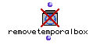
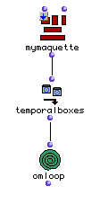
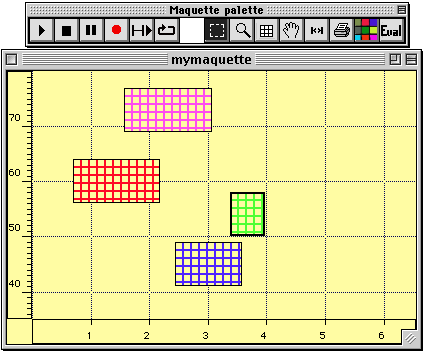
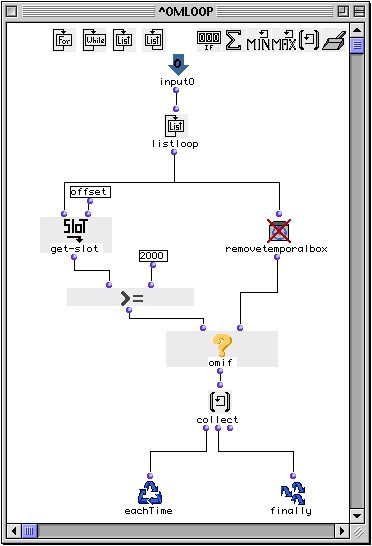
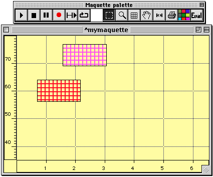

OpenMusic Reference  
---  
[Prev](remove-dup)| | [Next](repeat-n)  
  
* * *

# removetemporalbox

  
  
removetemporalbox  
  
(maquette module) \-- removes [**Temporalbox**](temporalbox)es from
**Maquette** s  

## Syntax

   **removetemporalbox**  self  

## Inputs

name| data type(s)| comments  
---|---|---  
_self_ |  a [**Temporalbox**](temporalbox) object or list thereof| extracted from a **Maquette** in 'itself' mode  
  
## Output

output| data type(s)| comments  
---|---|---  
first| a [**Temporalbox**](temporalbox) object| The output will be the same as the input; the action is performed on the **Maquette** from which the [**Temporalbox**](temporalbox) is taken  
  
## Description

This function removes [**Temporalbox**](temporalbox)es from a
**Maquette**. It is usually used in conjunction with the  temporalboxes 
function, which extracts a list of [**Temporalbox**](temporalbox) objects
from a **Maquette**.  removetemporalbox  clears _all_
[**Temporalbox**](temporalbox) objects it processes from the originating
**Maquette**. If you want to clear certain
[**Temporalbox**](temporalbox)es and not others you must process them
individually, as in the example below.

|

Although  removetemporalbox  will accept any
[**Temporalbox**](temporalbox) object as an input, there must be a
**Maquette** in 'itself' mode somewhere above it in the program flow in order
for it to remove the [**Temporalbox**](temporalbox)es.
[**Temporalbox**](temporalbox) objects from other sources will not cause
an error but  removetemporalbox  will have no effect. To put an object in
'itself' mode, click on it once and hit **b**. A small box appears with an 'x'
in it. Click this box three times to cycle through the modes. 'Itself' mode is
indicated by a down arrow: ↓ This means that the maquette will pass itself
rather than its output.  
  
---|---  
  
To add temporal boxes to maquettes, use
[ addbox2maquette ](addbox2maquette)

For a complete discussion of the maquette concept, see the chapter
[Maquettes](concepts.maquettes)

## Examples

### Using  removetemporalbox  with  omloop  to selectively remove
[**Temporalbox**](temporalbox) objects from a **Maquette**.

As mentioned above,  removetemporalbox  removes **all**
[**Temporalbox**](temporalbox)es it processes. To remove then
selectively, we will extract a list of them from the target **Maquette** using
 temporalboxes , and then pass it to an [ omloop ](omloop) in order to
process the elements of this list individually:

Now, let's imagine that our **Maquette** has this interior structure
containing four [**Temporalbox**](temporalbox)es:

The x axis is the elapsed time, in seconds. You'll notice that two of the
objects start before the 2-second mark and two begin afterwards. In this case,
we will write our  omloop  function to discard those beginning after the
2-second mark, but the basic idea could be adapted to keep or discard objects
based on any of their parameters through the [ get-slot ](get-slot)
function. Here is the internal structure of our  omloop :

The list of [**Temporalbox**](temporalbox) objects given to  omloop  by
 temporalboxes  will be iterated by the  listloop  function. The key here is
the [ omif ](omif) function. If the first input evaluates t then the
second input will be evaluated, otherwise  omif  returns nil. Each of the
[**Temporalbox**](temporalbox) objects contains a value defining its
position on the x axis in its  _offset_  [_slot_](glossary#SLOT). We use
 get-slot  to return this value, the elapsed time in milliseconds, for each of
the [**Temporalbox**](temporalbox) objects. If this value is less than
2000,  omif  returns nil. If it is equal to or more than 2000, however, the
function  removetemporalbox  is evaluated, and the
[**Temporalbox**](temporalbox) currently being tested is passed to it.
 removetemporalbox  returns the same [**Temporalbox**](temporalbox) at
its output, but removes the box from the **Maquette** (way back up the chain
outside the  omloop , in 'itself' mode).

The result is that the green and blue boxes will be removed before your very
eyes:

* * *

[Prev](remove-dup)| [Home](index)| [Next](repeat-n)  
---|---|---  
remove-dup| [Up](funcref.main)| repeat-n

