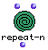
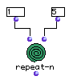
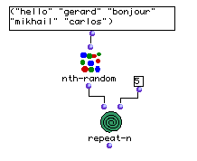

OpenMusic Reference  
---  
[Prev](removetemporalbox)| | [Next](rest)  
  
* * *

# repeat-n

  
  
repeat-n  
  
(control module) \-- evaluates `_self_` `_num_` times  

## Syntax

`` **repeat-n**` self num `

## Inputs

name| data type(s)| comments  
---|---|---  
` _self_`|  any|  
` _num_`|  a positive integer|  
  
## Output

output| data type(s)| comments  
---|---|---  
first| a list or tree| the results of repeated evaluations of `_self_`  
  
## Description

`repeat-n` evaluates the connection to its first output `_num_` times, and
collects the results into a list. It can be used to create a list of repeated
values or to evaluate a function repeatedly

## Examples

### Creating a repeating list with `repeat-n`

Here we give 1 and 5 to `repeat-n`. The 1 is evaluated 5 times:

`? OM->(1 1 1 1 1)`

### Using `repeat-n` to evaluate a function

Here we use a function instead of a numerical expression. Note that the
function is not in lambda mode. Since `nth-random` returns a random element
from the list each time, a possible output might be:

`? OM->("mikhail" "gerard" "hello" "carlos" "hello")`

* * *

[Prev](removetemporalbox)| [Home](index)| [Next](rest)  
---|---|---  
removetemporalbox| [Up](funcref.main)| rest

