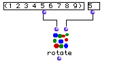

OpenMusic Reference  
---  
[Prev](reverse)| | [Next](samplefun)  
  
* * *

# rotate

  
  
rotate  
  
(combinatorial module) \-- returns a list with its elements rotated  

## Syntax

`` **rotate**` list &optional nth `

## Inputs

name| data type(s)| comments  
---|---|---  
` _list_`|  a list or tree| the list to be rotated  
` _nth_`|  an integer| optional; defaults to 1. the element from which to
begin the rotation. For purposes of this input, the first element of the list
is considered to be the 0th element. Thus, entering 0 at this input will
return the list unchanged  
  
## Output

output| data type(s)| comments  
---|---|---  
first| a list| the rotated list  
  
## Description

This module returns a circular permutation of the list, starting from its nth
element. As in all lisp functions, the first element of any list is considered
to be the 0th element.

## Examples

### Rotating a list

Here the list (1 2 3 4 5 6 7 8 9) is passed to the function. The optional
input is not used, so the list is rotated by one element: (2 3 4 5 6 7 8 9 1).

Here, the optional input is set to 5. Starting from zero, we count five
elements in. The list returned is (6 7 8 9 1 2 3 4 5).

Finally, we can use a negative integer at `_nth_`. This causes `rotate` to
count backwards from the first element. The list thus returned is (9 1 2 3 4 5
6 7 8).

* * *

[Prev](reverse)| [Home](index)| [Next](samplefun)  
---|---|---  
reverse| [Up](funcref.main)| samplefun

