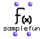
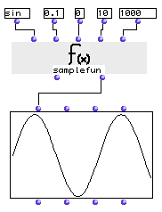
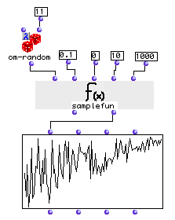

OpenMusic Reference  
---  
[Prev](rotate)| | [Next](save-as-etf)  
  
* * *

# samplefun

  
  
samplefun  
  
(functions module) \-- samples a function's output at defined intervals  

## Syntax

   **samplefun**  ` fun step &optional xmin xmax coeff ` 

## Inputs

name| data type(s)| comments  
---|---|---  
_fun_ |  a function name or lambda function| the function to sample  
_step_ |  a positive number| the interval between samples; defaults to 1  
_xmin_ |  a number| optional; the beginning of the range of values for which to sample  _fun_  ; defaults to 0  
_xmax_ |  a number| optional; the end of the range of values for which to sample  _fun_  ; defaults to 10  
_coeff_ |  a number| optional; the results of the sampling are multiplied by this coefficient; defaults to 1.  
  
## Output

output| data type(s)| comments  
---|---|---  
first| a list| containing samples of function  fun 's output  
second| a **BPF** object| can be plugged directly into a **BPF** to display the sampled values graphically  
  
## Description

 samplefun  passes a series of values to a function returns the results,
either in a list or displayed graphically in a **BPF** object.

The a range of values between  _xmin_  and  _xmax_  are passed sequentially to
 fun . The results are multiplied by  _coeff_  and collected as the output.
The first value is  _xmin_  After that,  _step_  is added to  _xmin_  and the
result is passed to  fun . This, continues, augmenting the value passed each
time by  _step_  , up to the value specified at  _xmax_ .

The values can be taken directly at the first output in a list, or read as a
**BPF** object at the second output. The scales of the axes of the **BPF** are
adjusted automatically so that the entire range of values fits on the screen.

## Examples

### Graphing a sine wave

Here we graph a sine wave. The function  sin  is given the values bewtween 0
and 10 (the defaults, see warning) by increments of .1 (i.e. 0, .1, .2, .3
etc.). The results are multiplied by  _coeff_  , which defaults to 1000;
again, see warning. Multiplying the values by 1000 makes them display better
in the **BPF** since the **BPF** rounds off values to no decimal places by
default and this would destroy the curve. The results are returned in a list
(are you ready?):

` ? OM->(0.0 99.83341664682816 198.66933079506126 295.5202066613396
389.4183423086505 479.425538604203 564.6424733950354 644.217687237691
717.3560908995227 783.3269096274832 841.4709848078965 891.2073600614353
932.0390859672262 963.5581854171929 985.4497299884603 997.4949866040545
999.5736030415051 991.6648104524686 973.847630878195 946.3000876874144
909.2974268256814 863.2093666488735 808.4964038195898 745.7052121767197
675.4631805511503 598.4721441039558 515.5013718214634 427.379880233829
334.98815015590384 239.24932921398113 141.1200080598659 41.580662433289156
-58.374143427581416 -157.74569414324995 -255.54110202683293 -350.7832276896215
-442.5204432948541 -529.8361409084948 -611.8578909427207 -687.7661591839754
-756.8024953079295 -818.2771110644113 -871.5757724135887 -916.1659367494552
-951.6020738895161 -977.530117665097 -993.6910036334644 -999.9232575641008
-996.1646088358408 -982.4526126243328 -958.924274663139 -925.8146823277331
-883.4546557201545 -832.2674422239027 -772.7644875559894 -705.5403255703944
-631.2666378723244 -550.6855425976413 -464.6021794137613 -373.876664830241
-279.415498198931 -182.16250427210113 -83.0894028175026 16.813900484343495
116.54920485048659 215.1199880878086 311.5413635133711 404.849920616591
494.1133511386012 578.4397643881929 656.9865987187824)  `

This kind of data is not very approachable. Connecting the second output to a
**BPF** object and evaulating that makes the data visual. The result is shown
above; the sine wave is clearly visible.

### Visualizing the results of a lambda function

Here's an example of connecting a function in lambda mode and visualizing the
results through the bpf output. The function  om-random  returns random
numbers between the values specified at its two inputs. The second input is
set to 11. The first input will be the values passed by  samplefun . We can
see from the inputs that they will start at 0 and run through 10 by increments
of .1. As they rise, the possible range of values returned by  om-random  will
get smaller; this trend is clearly visible in the **BPF**.

* * *

[Prev](rotate)| [Home](index)| [Next](save-as-etf)  
---|---|---  
rotate| [Up](funcref.main)| save-as-etf

