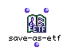

OpenMusic Reference  
---  
[Prev](samplefun)| | [Next](save-as-midi)  
  
* * *

# save-as-etf

  
  
save-as-etf  
  
(score module) \-- Saves a [**Voice**](voice) or [**Poly**](poly)
object as an [_ETF_](glossary#ETF) (Enigma Transportable File).  

## Syntax

   **save-as-etf**    self &optional approx   

## Inputs

name| data type(s)| comments  
---|---|---  
_self_ |  A [**Voice**](voice) or [**Poly**](poly) object|  
_approx_ |  Either 2, 4, or 8|  
  
## Output

output| data type(s)| comments  
---|---|---  
first| t|  
  
## Description

This function saves the connected [**Voice**](voice) or
[**Poly**](poly) object as an [_ETF_](glossary#ETF), a file type
supported by the Finale notation software. When evaluated, a dialog box
appears where you choose where to save the file.

The optional  _approx_  input is used to set the pitch resolution of the
export: 2 for semitone, 4 for quartertone, 8 for eighthtone.

* * *

[Prev](samplefun)| [Home](index)| [Next](save-as-midi)  
---|---|---  
samplefun| [Up](funcref.main)| save-as-midi

