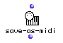

OpenMusic Reference  
---  
[Prev](save-as-etf)| | [Next](second)  
  
* * *

# save-as-midi

  
  
save-as-midi  
  
(midi module) \-- creates a MIDI file from an OM music class object  

## Syntax

   **save-as-midi**   object 

## Inputs

name| data type(s)| comments  
---|---|---  
_self_ |  any OM score class object|  **Voice** , **Poly** , **Chord-seq** , **Multi-seq** , etc.  
  
## Output

output| data type(s)| comments  
---|---|---  
first| a tree|  
  
## Description

 save-as-midi  takes any OM score class object and produces a MIDI file.
Evaluating this box opens a save dialog box where you specify where you want
to save the document.

To reverse the process, create a **Midifile** object and connect its output to
the first input of a **Chord-seq** or **Multi-seq** object. If you need to
work with rhythmic notation you can then plug the first output of that object
into the first input of a **Voice** or **Poly** object.

* * *

[Prev](save-as-etf)| [Home](index)| [Next](second)  
---|---|---  
save-as-etf| [Up](funcref.main)| second

