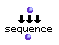
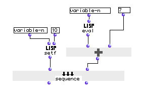

OpenMusic Reference  
---  
[Prev](select)| | [Next](sin)  
  
* * *

# sequence

  
  
sequence  
  
(control module) \-- evaluates a series of patches  

## Syntax

   **sequence**    patch &rest oppatch  

## Inputs

name| data type(s)| comments  
---|---|---  
  _patch_ |  any|  
  _oppatch_ |  any| repeatable; additional patches to evaluate  
  
## Output

output| data type(s)| comments  
---|---|---  
first| any| the results of the first patch  
second| any|  sequence  has as many outputs as inputs, each output returning
the results of the corresponding input  
  
## Description

 sequence  is used when you need to evaluate a series of patches one after the
other. You can add as many inputs as you like; outputs will be created at the
same time. When used, the patches or functions connected are evaluated in
order from left to right. Even if nothing is connected to some outputs, all
the inputs will be evaluated.

## Examples

### Using  sequence  to bind and evaluate a variable

Here, the LISP function  setf  is used to bind the value 10 to the variable
 variable-n  at the first input. The second input takes the function  om+ ,
which adds the value of  variable-n  (evaluated with the function  eval ) to
7. The second output of sequence will return:

 ? OM->17 

Note that both patches were evaluated (or else the answer would not have been
17 since the number 10 would not have been assigned to  variable-n ) even
though we only took the value of the second input.

* * *

[Prev](select)| [Home](index)| [Next](sin)  
---|---|---  
select| [Up](funcref.main)| sin

