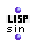

OpenMusic Reference  
---  
[Prev](sequence)| | [Next](sort)  
  
* * *

# sin

  
  
sin  
  
(lisp module) \-- returns the sine of `_radians_`  

## Syntax

`` **sin**` radians `

## Inputs

name| data type(s)| comments  
---|---|---  
` _radians_`|  a number| the angle whose sine to compute, in radians  
  
## Output

output| data type(s)| comments  
---|---|---  
first| a number|  
  
## Description

Computes the sine of the angle `_radians_` , expressed in radians.

* * *

[Prev](sequence)| [Home](index)| [Next](sort)  
---|---|---  
sequence| [Up](funcref.main)| sort.

