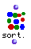
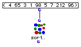
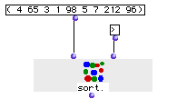
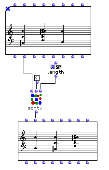

OpenMusic Reference  
---  
[Prev](sin)| | [Next](sqr)  
  
* * *

# sort.

  
  
sort.  
  
(combinatorial module) \-- returns a sorted list according to a test  

## Syntax

   **sort.**    lst &optional test key   

|

This function,  sort.  is easily confused with the lisp function  sort , which
has no period in its name. They function differently; be sure not to forget
the period after the name!  
  
---|---  
  
## Inputs

name| data type(s)| comments  
---|---|---  
_lst_ |  a list| the list to be sorted  
_test_ |  a symbol or function name or lambda function| optional; the test is the operation that will be applied to the elements of  _lst_  to sort them. It defaults to <, i.e. the elements will appear in ascending order. It must be a [predicate](glossary#PREDICATE).  
_key_ |  a symbol or function name or lambda function| optional; if specified, the key is used to evaulate the list before sorting.  
  
## Output

output| data type(s)| comments  
---|---|---  
first| a list| the sorted list  
  
## Description

This module sorts a list. By default, the order of the sort is ascending, but
since the module is extensible, you can open a second entry,  _test_  to set
the choice of order. If  _test_  is '>' the order is descending, while '<'
indicates ascending order. A third input  _key_  can be added. Normally, the
function specified at  _test_  is applied directly to the elements of  _lst_ 
itself in order to sort them. If you specify  _key_  , however, the test will
be applied to the results of passing each element of  _lst_  to the function
 _key_ .

## Examples

### Sorting a list

Here the list (4 65 3 1 98 5 7 212 96) is passed to the function. The sort
order defaults to '<' so the returned value is (1 3 4 5 7 65 96 98 212).

### Sorting a list II

Here the same list is passed to the function, but the optional input  _test_ 
has been added and changed to '>' so the list is returned in descending order.

### Sorting chords by number of tones

Here is a musical application of the  sort.  function. We will soort the
chords in the top sequence by the number of tones they contain. The  _lmidic_ 
output of the **Chord-seq** is used, which contains a list of lists of midics,
one for each chord. If we did not give  sort.  a key, it would attempt to
evaulate the entirety of each list of notes against its neighbors, producing
an error (try removing the key to see). Because we want to compare the number
of notes in each chord and not the lists themselves, we pass the lisp function
 length  in lambda mode to  sort.  as  _key_ . Thus, the result of  length 
for each list, i.e. (3 6 2) is compared, and the list is reordered according
to these results. The answer is then plugged back into the  _lmidic_  input of
a **Chord-seq** object and the chords are reconstituted in their new sorted
orer.

* * *

[Prev](sin)| [Home](index)| [Next](sqr)  
---|---|---  
sin| [Up](funcref.main)| sqr

