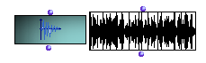

OpenMusic Reference  
---  
[Prev](poly)| | [Next](temporalboxclass)  
  
* * *

# Sound

  
  
Sound  
  
(score module) \--  

## Syntax

 **Sound**   self  

## Slots

name| data type(s)| comments  
---|---|---  
 _self_ | [ **Sound**](sound) object|
_tracknum_ | integer | a track index for multichannel mixing (0 = no specific track) |
_markers_ | list | a list of markers (s)|
  
## Notes

[ **Sound**](sound) factories are generally obtained by dragging an AIFF
file from the finder to a patch window. After doing that, lock the icon
immediately or you will lose its contents when you try to evaluate it.

An unlocked [**Sound**](sound) object when evaluated will bring up a
dialog box asking you to find an AIFF file.

* * *

[Prev](poly)| [Home](index)| [Next](temporalboxclass)  
---|---|---  
Poly| [Up](classref.main)| Temporalbox

