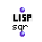

OpenMusic Reference  
---  
[Prev](sort)| | [Next](sqrt)  
  
* * *

# sqr

  
  
sqr  
  
(lisp module) \-- returns the square of  _n_   

## Syntax

   **sqr**  ` n `  

## Inputs

name| data type(s)| comments  
---|---|---  
_n_ |  a number|  
  
## Output

output| data type(s)| comments  
---|---|---  
first| a number|  
  
## Description

Returns the square of  _n_  , i.e.  _n_  times itself.

* * *

[Prev](sort)| [Home](index)| [Next](sqrt)  
---|---|---  
sort.| [Up](funcref.main)| sqrt

