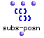
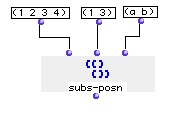

OpenMusic Reference  
---  
[Prev](sqrt)| | [Next](sysex)  
  
* * *

# subs-posn

  
  
subs-posn  
  
(lists module) \-- replaces select elements of a list  

## Syntax

`` **subs-posn**` lis1 posn val `

## Inputs

name| data type(s)| comments  
---|---|---  
` _lis1_`|  a tree| the master list  
` _posn_`|  a list of successiveintegers| the locations at which to place
elements from `_val_`  
` _val_`|  a tree| the list of replacement elements  
  
## Output

output| data type(s)| comments  
---|---|---  
first| a tree|  
  
## Description

This module substitutes elements from `_lis1_` at positions given in the list
`_posn_` with values, taken in sequence, from `_val_`. `subs-posn` functions
only at the first level of [nesting](glossary#NESTING); sublists in
either `_lis1_` or `_val_` are treated as single elements for purposes of the
substitution.

If the requested position in `_posn_` does not exist in `_lis1_` , the
substitution will not be made and the corresponding element of `_val_` will be
skipped.

|

`subs-posn` will not function correctly if the integers in `_posn_` are not in
ascending order  
  
---|---  
  
## Examples

### Replacing select elements of a list

Here, elements 1 and 3 of the list will be replaced with `a` and `b`:

`? OM->(1 a 3 b)`

* * *

[Prev](sqrt)| [Home](index)| [Next](sysex)  
---|---|---  
sqrt| [Up](funcref.main)| sysex

