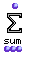
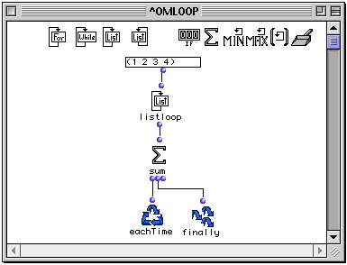
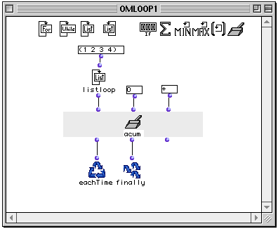

OpenMusic Reference  
---  
[Prev](counter)| | [Next](minim)  
  
* * *

# sum

  
  
sum  
  
(control module) \-- returns the sum of its collected elements  

## Syntax

   **sum**  what? &optional retard  

## Inputs

name| data type(s)| comments  
---|---|---  
  _what?_ |  a number|  
  _retard_ |  a function name or lambda function|  
  
## Output

output| data type(s)| comments  
---|---|---  
first| a number| triggers the collection  
second| a number| returns the state of the collection without evaluation  
third| 0| reinitializes the counter, resetting it to zero  
  
## Description

|

 sum  is part of a group of functions for performing iterative
[loops](glossary#LOOP). They can only be used within an
[omloop](omloop) patch window. Since they only function within the
context of the entire repeating loop, they (or any function connected to them)
cannot be evaluated directly within the patch window. You must evaluate the
entire loop. See the entry on  omloop  for more information.  
  
---|---  
  
 sum  is a type of collector. It returns the sum of all the results of the
loop.

Like all collectors,  sum  has three outputs:

The first output triggers the collector, evaluating whatever is connected to
it and adding that result to the value already stored by previous repetitions
of the loop. It is usually connected to  eachTime . The value carried by the
connection itself is the running total, which you can verify by placing the
lisp function  print  between the first output and  eachTime .

The second output returns the current state of the collector, without
evaluating whatever is connected to it. It is usually connected to  finally 
so that you can get the results of the addition.

The third output reinitializes the collector, resetting it to zero. The value
carried by the connection is always 0.

## Examples

|  **About the collectors**  
---|---  
 |

 sum  is a type of collector. The most generalized type of collector is the
function  accumulator . Some collectors are special versions of the
 accumulator  function. In these cases, the example of the use of the specific
collector is reproduced with accumulator to illustrate this. The reader is
therefore advised to read the entry on [ accumulator ](accumulator)
before continuing.  
  
### Using  sum 

This simple example adds the elements (1 2 3 4). They are passed individually
to  sum , which adds each to the previous total. The output is:

 ? OM->10 

### Reproducing  sum  with  accumulator 

We will set up  accumulator  to perform exactly the same function. The
 listloop  output of (1 2 3 4) is run into the first input. We set the initial
value to zero and connect the function  +  to the  _fun_  input. At each
iteration, the previous value of  accumulator  and the current value of
 listloop  are passed to  + . The result is stored, becoming the current value
of  accumulator  for the next pass.

* * *

[Prev](counter)| [Home](index)| [Next](minim)  
---|---|---  
counter (count)| [Up](funcref.omloop)| minim (min)

