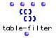

OpenMusic Reference  
---  
[Prev](sysex)| | [Next](tan)  
  
* * *

# table-filter

  
  
table-filter  
  
(lists module) \-- Filters sublists from a tree using the
[predicate](glossary#PREDICATE)  _test_ .  

## Syntax

 **table-filter** ` test list numcol mode  `

## Inputs

name| data type(s)| comments  
---|---|---  
_test_ |  a symbol or function name or lambda function| The predicate to apply. Defaults to  numberp   
_list_ |  a tree| the tree to filter  
_numcol_ |  a non-negative integer| the element of each sublist to pass to
_test_   
_mode_ |  menu| two options: pass and reject  
  
## Output

output| data type(s)| comments  
---|---|---  
first| a tree|  
  
## Description

 table-filter  takes each sublist of the tree  _list_  and applies the
function  _test_  to the element at position  _numcol_ .  _test_  may be any
[predicate](glossary#PREDICATE), either a function name or a patch in
lambda mode. If mode is set to  _reject_  then sublists whose  _numcol_  th
element return t when passed to  _test_  are rejected. If mode is set to
 _pass_  then only those sublists are kept.

|

 table-filter  is the sister function to [ list-filter ](list-filter),
which processes flat lists.  
  
---|---  
  
## Examples

### Filtering a tree

Here, the tree is tested using  oddp , a predicate which returns t only when
its object is an odd number. Since  _numcol_  is set to 0,  oddp  will be
applied to the first element in each sublist. The function is in  _reject_ 
mode, so only sublists whose first element is not an odd number will pass.
There is only one:

 ? OM->((4 5 6)) 

Reversing the mode will cause only sublists whose first element is an odd
number to pass:

 ? OM->((1 2 3) (7 8 9)) 

* * *

[Prev](sysex)| [Home](index)| [Next](tan)  
---|---|---  
sysex| [Up](funcref.main)| tan

