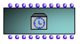

OpenMusic Reference  
---  
[Prev](sound)| | [Next](textfile)  
  
* * *

# Temporalbox

  
  
Temporalbox  
  
(maquette module) \--  

## Syntax

`` **Temporalbox**` self offset extend colorframe value posy stretch-fact
sizey free-store reference `

## Slots

name| data type(s)| comments  
---|---|---  
` _self_`|  a [**Temporalbox**](temporalbox) object| The
[**Temporalbox**](temporalbox) object itself. Can be used with
[`addbox2maquette`](addbox2maquette) and related functions.  
` _offset_`|  a non-zero integer| The distance of the left edge of the
enclosing box from the zero point of the x axis, in milliseconds.  
` _extend_`|  a non-zero integer| The duration of the object (or of the
musical object connected to `_tempout_` , if a patch) as played, not as
represented graphically, in milliseconds.  
` _colorframce_`|  a non-zero integer| a value representing the color assigned
to the enclosing box.  
` _value_`|  the reference of an OM playable music object| the object
reference, in practice, is the object connected to the `_tempout_` of the
enclosing box.  
` _posy_`|  an integer| The height of the top edge of the enclosing box, as
measured against the y axis.  
` _stretch-factor_`|  a positive float| The ratio of the distance spanned by
the enclosing box graphically against the time axis of the maquette to the
real duration of the object. A value of 1 means the object is drawn at 'actual
length'. Values smaller than 1 represent a compression, larger values an
expansion.  
` _sizey_`|  a non-zero integer| The length of the left edge of the box as
measured against the y axis.  
` _free-store_`|  any| An open slot where values may be stored using the get-
set-slot mechanism. See the chapter on Classes for more information on the
get-set-slot mechanism.  
` _reference_`|  an internal OM reference (memory location)| The OM internal
reference for the [**Temporalbox**](temporalbox) object. It can't be put
in reference mode, so you must take this value here if you need it. See the
Chapter on Patches for more info on reference mode.  
  
## Notes

The [**Temporalbox**](temporalbox) object is the wrapper for patches and
music objects placed within a Maquette. Its outputs return information about
the geometry of the box within the Maquette frame making this information
available to the patch for possible inclusion in computations.

For more information on the Maquette concept, see the chapter [**on
Maquettes**](concepts.maquettes) and [tutorial 32](tut.gen.32), on
Maquettes.

* * *

[Prev](sound)| [Home](index)| [Next](textfile)  
---|---|---  
Sound| [Up](classref.main)| Textfile

