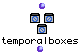
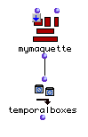

OpenMusic Reference  
---  
[Prev](tan)| | [Next](third)  
  
* * *

# temporalboxes

  
  
temporalboxes  
  
(maquette module) \-- extracts a list of [**Temporalbox**](temporalbox)es
from a **Maquette**  

## Syntax

 **temporalboxes**   self  

## Inputs

name| data type(s)| comments  
---|---|---  
 _self_ |  a **Maquette**|  in   itself   mode  
  
## Output

output| data type(s)| comments  
---|---|---  
first| a list of [**Temporalbox**](temporalbox) objects|  
  
## Description

This function returns all the [**Temporalbox**](temporalbox)es in a
**Maquette** in a list. The **Maquette** passed must be in 'itself' mode. To
put an object in 'itself' mode, click on it once and hit **b**. A small box
appears with an 'x' in it. Click this box three times to cycle through the
modes. 'Itself' mode is indicated by a down arrow: ↓ This means that the
**Maquette** will pass itself rather than its output:

This function is usually used in conjunction with
[ removetemporalbox ](removetemporalbox) or by reconnecting the elements
of the [**Temporalbox**](temporalbox)es to [_class
factory_](glossary#FACTORY) icons in order to extract their parameters
(their positions within the box, what they contain, etc.)

This function takes a **Maquette** and extracts a
[**Temporalbox**](temporalbox). The reverse is performed by [ get-
maquette ](get-maquette)

For a complete discussion of the maquette concept, see the chapter
[Maquettes](concepts.maquettes)

* * *

[Prev](tan)| [Home](index)| [Next](third)  
---|---|---  
tan| [Up](funcref.main)| third

