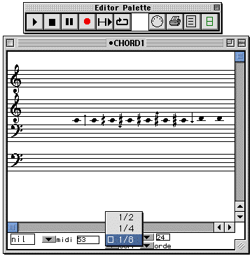

OpenMusic Tutorials  
---  
[Prev](tut.gen.1-9)| Chapter 1. Using Musical Objects I|
[Next](tut.gen.2)  
  
* * *

# Tutorial 1: Transposing pitches

## Topics

Using an arithmetic function to transpose pitches

## Key Modules Used

[ **Chord**](chord), [`om+`](omplus)

## The Concept:

Pitches in OM are expressed in [_midicents_](glossary#MIDIC), or midics.
Midics are [_MIDI_](glossary#MIDI) values (60 corresponding to middle C
on the piano) multiplied by 100. 100 midicents = 1 semitone.

Transposing a note is thus equivalent to adding or subtracting from its midic
value. We'll do this with a simple arithmetic operator [`om+`](omplus).

The notes to transpose are found in a [**Chord**](chord) object but we
could take any midic output for the operation.

We will also learn how to lock modules so their contents are retained.

## The Patch:

This patch transposes the notes in [**Chord**](chord) box (A) by adding
(C) the value you have entered at the second input to [`om+`](omplus) (B)
to every note. The midics are then reentered into a [**Chord**](chord)
object so we can see the results.

Double-click the first [**Chord**](chord) box (A) to open the graphic
editor. The chord is displayed on four staves, as indicated by the pulldown
menu reading 'GGFF'. The top treble and bottom bass clef are an octave below
and above sounding pitch. This is convenient if your musical object has lots
of ledger lines.

|  **The mini-view**  
---|---  
 |

These [**Chord** s](chord) are already in mini-view, allowing you to see
their contents. Mini-visualization is turned on and off with the **m** key
(with the box selected). Using option-↑/↓ allows you to move the miniview.  
  
Choose order from the pull-down view menu in the [**Chord**](chord) box:

The chord changes to display its notes in the order they were entered (which
is not necessarily an ascending arpeggio, although this happens to be the case
here:

To add notes in the [**Chord**](chord) editor, hold option and click
where you'd like to insert the new note. Then close the chord box.

When you evaluate the [**Chord**](chord) box, it takes data from its
inputs. If nothing is connected, this will effectively reset the
[**Chord**](chord) to its default state since it will read the default
settings of the inputs. In order to preserve the notes we add, as well as the
notes already present, we must lock the [**Chord**](chord), if it is not
locked already. Here is an unlocked [**Chord**](chord):

By clicking on the box to select it and hitting **b** , we lock the box, which
is shown by an X in the upper left-hand corner of the box:

A locked box retains its value(s) and always outputs them when evaluated. It
does not take data from its inputs. Make sure your upper
[**Chord**](chord) box is locked. Also make sure the lower
[**Chord**](chord) box is not locked or else you won't see the transposed
notes.

Now evalute the patch by clicking once on the lower [**Chord**](chord)
object and hitting **v**. You'll see the newly transposed notes.

Now, enter another transposition value in the box connected to the right input
of the [`om+`](omplus) box. To transpose by a semitone you have to enter
the value 100. A quarter-tone corresponds to a value of 50 and a eighth of a
tone to 25. (Notice that both quarter- and eighth-tone pitches can be
expressed in whole numbers- the advantage of midics.) If you enter a positive
number, the original notes will be transposed up, otherwise they will be
transposed down.

The OM music object editors automatically 'round off' pitches for display. By
default, they display pitches in a twelve-tone octave, even if the midics are
not multiples of 100. To confirm this, set the input of [`om+`](omplus)
to 50, which will transpose the notes up by a quarter tone. Evaluate the lower
[**Chord**](chord) box. You won't see and quarter tones. In order to turn
on quarter-tone visualization, use the pull-down menu in the
[**Chord**](chord) editor:

Now you should see quarter tones.

* * *

[Prev](tut.gen.1-9)| [Home](index)| [Next](tut.gen.2)  
---|---|---  
Using Musical Objects I| [Up](tut.gen.1-9)| Tutorial 2: Inverting an
interval

