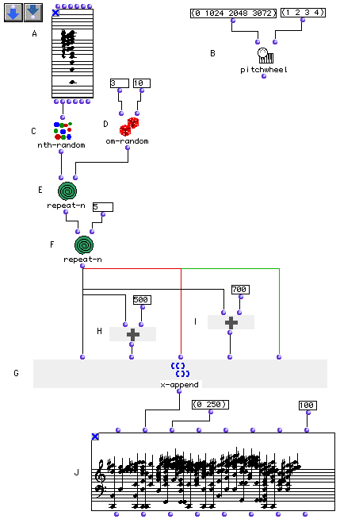

OpenMusic Tutorials  
---  
[Prev](tut.gen.11-13)| Chapter 3. Using Aleatoric Elements|
[Next](tut.gen.12)  
  
* * *

# Tutorial 11: Constructing a [**Chord**](chord) with random notes from a
harmonic spectrum

## Topics

Using a random functions to choose elements from a harmonic series which are
then built into [**Chord**](chord)s

## Key Modules Used

[`pitchwheel`](pitchwheel), [`x-append`](x-append), [`om-
random`](om-random), [`nth-random`](nth-random),
[`repeat-n`](repeat-n), [`om+`](omplus), [**Chord-seq**](chord-
seq)

## The Concept:

The [`repeat-n`](repeat-n) box evaluates the function at its first input
a number of times (indicated at the second input) and returns the result as a
list. The [`om-random`](om-random) box returns a random number between
its two inputs. We start with the harmonic spectrum chord generated in
Tutorial 8. We'll build 5 groups of random chords from its elements, then
transpose the second of the groups up by a fourth and the fourth of the groups
up by a fifth, creating a sort of demented I-IV-I-V-I progression.

If you built a different harmonic series in Tutorial 8 and want to use it
here, hold option and drag it into the Tutorial 11 window- this will create a
copy of your original object. Note that this works with any object or group of
objects.

## The Patch:

[`nth-random`](nth-random) (C) chooses a random note from the chord (A).
This is repeated by [`repeat-n`](repeat-n) (E) a random number of times
set by [`om-random`](om-random) (D). This will yield a list of random
midics of a random length. This entire operation is itself carried out 5 times
by the second [`repeat-n`](repeat-n) box (F). Each time it is evaluated
it returns a group of 5 chords (in midics) with between 3 and 10 members.

[`x-append`](x-append) creates a list with all its inputs. In this case,
all the inputs come from [`repeat-n`](repeat-n). Since
[`repeat-n`](repeat-n) produces itself produces a list,
[`x-append`](x-append) will create a list of lists- what is called a
tree.

The second and fourth inputs to [`x-append`](x-append) are passed through
[`om+`](omplus) (H & I) for a transposition. The others are untouched.
Note that [`x-append`](x-append) has 5 inputs here- each of those inputs
causes [`repeat-n`](repeat-n) to be evaluated anew. This means that each
group of 5 chords will be different, randomly generated.

The result of [`x-append`](x-append) is a list of lists. Remember the
discussion of data type in Tutorial 9? Well, the `_lmidic_` input of the
[**Chord-seq**](chord-seq) object can take either a list of integers, in
which case it assumes they are individual notes to be taken in order, or a
list of lists, a tree, in which case it assumes each sublist represents a
chord. That is what happens here.

When you are done, you can play the [**Chord-seq**](chord-seq). You may
need to evaluate the [`pitchwheel`](pitchwheel) function in the upper-
right in order that the microtones play back correctly. (See Tutorial 10 for
more info).

* * *

[Prev](tut.gen.11-13)| [Home](index)| [Next](tut.gen.12)  
---|---|---  
Using Aleatoric Elements| [Up](tut.gen.11-13)| Tutorial 12: Building a
sequence of random notes: [`om-random`](om-random)

