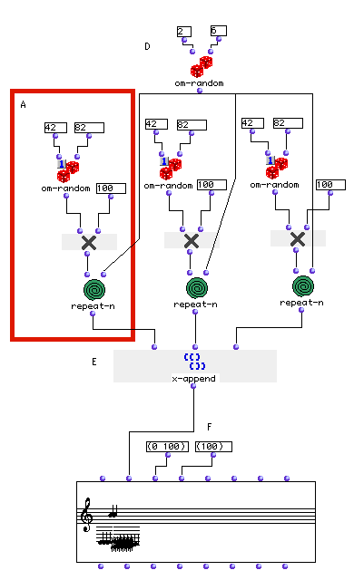
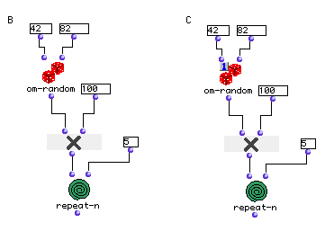
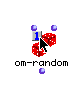

OpenMusic Tutorials  
---  
[Prev](tut.gen.11.sgm)| Chapter 3. Using Aleatoric Elements|
[Next](tut.gen.13)  
  
* * *

# Tutorial 12: Building a sequence of random notes: [`om-random`](om-
random)

## Topics

Using [`om-random`](om-random) and [`repeat-n`](repeat-n) to build
sequences of repeated notes.

The 'eval-once' mode for modules.

## Key Modules Used

[`om-random`](om-random), [`repeat-n`](repeat-n), [**Chord-
seq**](chord-seq), [`x-append`](x-append)

## The Concept:

This example shows the use of [`om-random`](om-random) for generating
random repeated notes. We will use this function in two different ways:
generating pitch and generating the number of repeated notes. [`om-
random`](om-random) will be used in both normal and 'eval-once' modes.

## The Patch:

First of all we will generate midicent notes by using [`om-random`](om-
random). This function takes as arguments two numbers (integer or float).
The two arguments represent the range of numbers that [`om-random`](om-
random) will produce, inclusive. For our example, we will use MIDI notes
and then multiply the output by 100 to obtain midics. On the right, we've
connected these to [`repeat-n`](repeat-n), allowing us to obtain a series
of 5 random midics in a list:

Now let's compare the outputs of (B) and (C). The output of the B patch is a
list of five different values each time it is evaluated, while the ouput of C
patch is a list of five identical values. Why? The difference is the state of
the om-random patch. Notice the little "1" in the upper-left corner of the
[`om-random`](om-random) on the right? That means the function is in
'eval-once' mode, and will only evaluate once for each time the flowchart is
evaluated. This means that it will return the same value each subsequent time
it is called by [`repeat-n`](repeat-n). In contrast, the other [`om-
random`](om-random) generates a new random midic each time.

To put a patch into 'eval-once' mode, select it and hit **b** this brings up
the little "X", which means the function is locked. The lock is one of four
special modes which can be applied to boxes. Clicking one on the "X" changes
it into a 1, which indicates 'eval-once' mode. You can return the box to
normal by hitting **b** a second time.

On the left, we've copied B and C, replacing the input 5 with another [`om-
random`](om-random)to generate the integers for the number of repeated
notes. Notice that we have used one om-random module instead of three. That is
because (D) is in normal mode, and will be evaluated three times because its
output is connected to three other inputs.

Connecting the outputs of the three [`repeat-n`](repeat-n) modules to
[`x-append`](x-append) (E) will result in one big list.

We will use a [`Chord-seq`](chord-seq) editor to collect our resulting
notes. The first input of the [**Chord-seq**](chord-seq) editor is
`_self_` , the object itself, as with all editors and classes. The second
input is the midic input. Remember the idea of inheritance from Tutorial 9?
The [**Chord-seq**](chord-seq) class inherits from the
[**Chord**](chord) object.. This means that you can pass a list of
[**Chord**](chord) objects to the first input `_self_` of a [**Chord-
seq**](chord-seq) to obtain a sequence of chords.

Alternatively, as described in the last tutorial, the `_lmidic_` input can
accept a tree of midics, where each sublist is interpreted as a chord.
However, we've entered a flat list with no sublists, so [**Chord-seq**](chord-
seq) will interpret this to mean a series of notes- a series of one-note
chords, actually. Try evaluating the second output of the [**Chord-
seq**](chord-seq) and compare with the output of
[`x-append`](x-append) (E).

The third input of the [**Chord-seq**](chord-seq) object is a list of
onsets times, i.e. chord positions in the sequence in elapsed milliseconds.
The elements of this list are paired up with the elements of `_lmidic_` to
determine where the chords are. By the same token, the fourth is a list of
durations, also in milliseconds. In the example above we have changed the
default values (0 1000) and (1000) to shorter durations so that the thing will
play faster. If we enter just two values for the onsets then [**Chord-
seq**](chord-seq) assumes that these two values define the interval
between chords. This is what happens here; [**Chord-seq**](chord-seq)
puts the notes 100ms apart.

The same is true of the duration input, `_ldur_`. A single value causes
[**Chord-seq**](chord-seq) to assume that the duration is global and
applies to all notes. If you enter more than one duration but not enough to
pair off with every chord, the last value entered is used for all remaining
chords. The same is true of the onsets.

* * *

[Prev](tut.gen.11.sgm)| [Home](index)| [Next](tut.gen.13)  
---|---|---  
Tutorial 11: Constructing a [**Chord**](chord) with random notes from a
harmonic spectrum| [Up](tut.gen.11-13)| Tutorial 13: Another random
sequence

