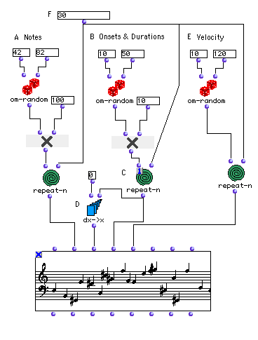
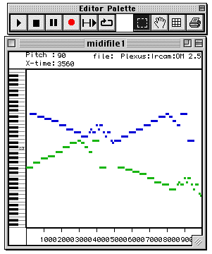
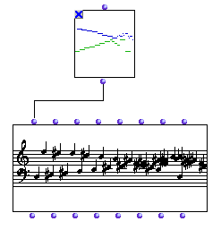
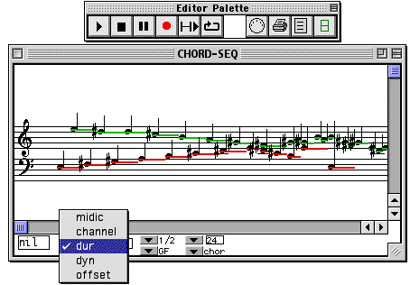
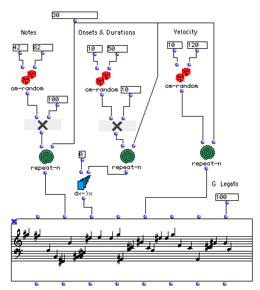
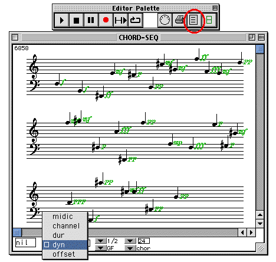

OpenMusic Tutorials  
---  
[Prev](tut.gen.12)| Chapter 3. Using Aleatoric Elements|
[Next](tut.gen.14)  
  
* * *

# Tutorial 13: Another random sequence

Introduction to durations, velocities and legato

## Topics

The inputs `_ldur_` , `_lvel_` , and `_legato_`.

## Key Modules Used

[`om-random`](om-random), [**Chord-seq**](chord-seq),
[`repeat-n`](repeat-n), [`dx->x`](dx-x)

## The Concept:

We use a similar structure here, extending our random procedure to the onsets
and durations of the notes.

## The Patch:

We will use the same patch as in tutorial 10. [`om-random`](om-random)
will be back in its normal mode, because here we don't need repeated notes.

At (B), we will use patch we used for durations with slightly different
parameters to produce lists of numbers appropriate to onsets and durations.
[`om-random`](om-random) will generate values between 100ms to 500ms.
(Durations and onsets in OM music editors are always expressed in
milliseconds.)

We want to create a sequence with no gaps between the notes. This means that
the onsets and the durations have to match up. We make sure that the same
sequence is used by setting [`repeat-n`](repeat-n) to 'eval-once' mode.

There's another problem. Durations are simply the durations of the notes once
struck. Offsets, on the other hand, are measured from the beginning of the
sequence. This means we can't use the same list for both `_lonset_` and
`_ldur_` inputs. Using [`dx->x`](dx-x), we turn the list of durations
(the time between notes) into a list of onsets relative to the starting time,
0.

As we just learned, notes in a [**Chord-seq**](chord-seq) can overlap.
The [**Chord-seq**](chord-seq) object can thus accept polyphonic input.
For example, place a **Midifile** class in the patch and evaluate it. A dialog
window comes up. Look for the file `INV6.MID` in the `exampleFiles/Midi`
folder, in the main OM folder. This is a MIDI file of the 6th two-part
invention by J.S. Bach. Once evaluated, lock the box.

Opening the **Midifile** brings up a piano-roll style editor where you can see
the two channels of the MIDI file, color coded for clarity:

The [**Chord-seq**](chord-seq) class can take a MIDI file as input to its
`_self_` input, and it will be transcribed:

Opening the resulting [**Chord-seq**](chord-seq) and selecting dur from
the view options pop-up menu will show the durations of the notes represented
as colored bars:

Returning to our patch, giving a single number to all 3 second inputs of the
[`repeat-n`](repeat-n) box causes each element to be evaluated 3 times,
producing lists of the same length for our midics, onsets, durations, and note
velocities.

Note velocity is MIDI's way of indicating how hard a note is struck. You can
visualize the velocity by selecting dyn from the view options pop-up in the
editor. Here is an example in page mode, which is turned on using the page
view button, circled in red.

OM turns the velocities into traditional dynamic marks using a table you set
up in the [Preferences panel](concepts.preferences). Now look at the far
right-hand input, `_legato_`. Setting this to 0 leaves durations as they are.
Any other number, however, will override the `_ldur_` input, and set the
durations to a percentage based on 100 being perfect legato- each note lasting
exactly as long as it needs to. Smaller numbers will result in gaps in the
sequence, longer numbers in overlaps (you need to set the view to dur).

* * *

[Prev](tut.gen.12)| [Home](index)| [Next](tut.gen.14)  
---|---|---  
Tutorial 12: Building a sequence of random notes: [`om-random`](om-
random)| [Up](tut.gen.11-13)| Flow Control I: Predicates

