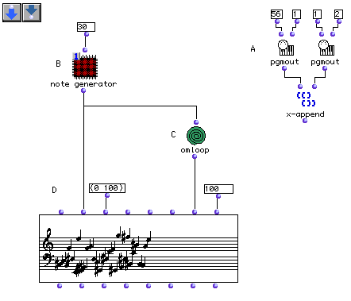
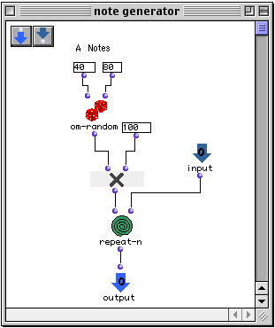
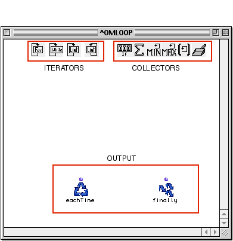
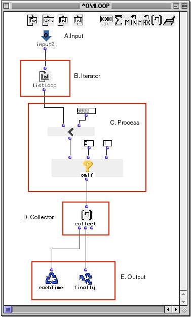
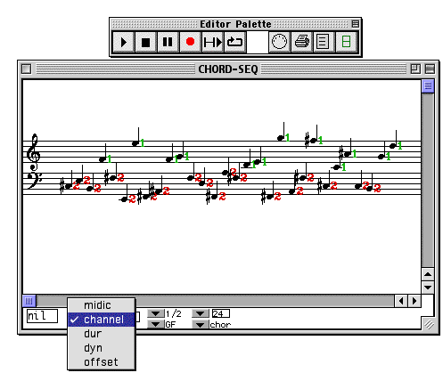

OpenMusic Tutorials  
---  
[Prev](tut.gen.15-16)| Chapter 5. Flow Control II: Loops|
[Next](tut.gen.16)  
  
* * *

# Tutorial 15: Introduction to [`omloop`](omloop) I

## Topics

Basic enumeration of a list with [`omloop`](omloop)

## Key Modules Used

[`pgmout`](pgmout), [`omloop`](omloop), [`om<`](omlessthan)

## The Concept:

In this example notes are generated and are filtered onto two midi channels
depending on their pitch. All notes above 6000 midicents (inclusive) will be
played on channel one. Other notes falling under 6000 midics will be played on
channel 2, which will have a different instrument sound. In this way the
melody will be split between two instruments in the [**Chord-seq**](chord-
seq) module.

## The Patch:

This patch contains two different sections: Section A, whose task is to send
MIDI messages, and sections B-C-D which generate the notes.

[`pgmout`](pgmout) is a MIDI function which sends program change messages
to internal or external MIDI devices, such as the Quicktime synthesizer. As
you know, this function always returns nil value in the listener.
[`x-append`](x-append) is used as a "trick" to evaluate both
[`pgmout`](pgmout)s simultaneously. The first sends the program change 56
to channel one, while the second module sends program change 1 to channel two.

At (B), we've created an abtraction (red patch). Remember these? Look back to
Tutorial 8 if you don't remember. Here's what it looks like on the inside:

In this patch we have reproduced the random pitch generation patch (A) found
from [tutorial 13](tut.gen.13). You could just option-drag the elements
you need from that Tutorial into this one. Notice that we have added an input
for the `_times_` argument of [`repeat-n`](repeat-n) in order to be able
to control this parameter from within the main patch. Notice that note
generator (B) is in eval-once mode. This is because its output is connected to
two modules ([ **Chord-seq**](chord-seq) and [`omloop`](omloop)) .
If our patch note generator was in its normal mode it would have yielded
different results in the [**Chord-seq**](chord-seq) module and the
[**omloop**](omloop) resulting in a mismatching of elements (notes and
channels).

We need to create a list of channel assignments based on the pitches of the
generated notes. We will use [`omloop`](omloop) in one of its most common
roles- to go through the elements of a list, one by one, and collect some sort
of data.

When you create an [`omloop`](omloop) module, it looks like this on the
inside:

By default, it has no inputs. Inputs are added to the function by clicking on
it outside in the patch window and using option- **->** , just like for
[`x-append`](x-append).

Opening it, we distinguish three groups of modules: the iterators, the
accumulators and the outputs. (For further information about these, please
consult the [Function Reference](funcref).) .These modules are specific
to [`omloop`](omloop) and can only be accessed within this module. When
[`omloop`](omloop) is in its editing mode (i.e opened), nothing connected
to these special functions can be evaluated. This is because these special
functions will have different values each time the loop is evaluated. One must
first close the module and evaluate its output as with any other function.

Let us now examine our loop patch. We will use [`omloop`](omloop) to test
each member of the list output from our note generator patch. As we can see,
the patch is divided into four functional parts:

First we will use the [`listloop`](listloop) iterator (B), which will
'ticks off' each member of a list. On each repetition of the loop, the next
member of the list is passed by [`listloop`](listloop) to (C). At (C),
the enumerated element could be processed in any way. Here a midicent will be
tested using [`omif`](omif) using the
[predicate](glossary#PREDICATE) [`om<`](omlessthan). If the midicent
is smaller than 6000, omif will output 2, and if not, it outputs 1, our
channel assignments. This result will be collected by the
[`collect`](listing) module. The [`collect`](listing) module simply
accumulates the results from each repetition of the loop into a list.

[`collect`](listing)'s first output is connected to
[`eachTime`](loopdo), which triggers the repetitions of the loop, and the
second to [`finally`](finaldo), which carries the results of the finaly
repetition of the loop to the output. Whatever is connected to
[`finally`](finaldo) gets passed to the output of the loop in the main
patch window. This is the usual way to connect collectors and is valid 90% of
the time.

Now let's verify our result in the [**Chord-seq**](chord-seq) editor,
choosing in channel from the view options menu:

* * *

[Prev](tut.gen.15-16)| [Home](index)| [Next](tut.gen.16)  
---|---|---  
Flow Control II: Loops| [Up](tut.gen.15-16)| Tutorial 16: Introduction to
[`omloop`](omloop) II

