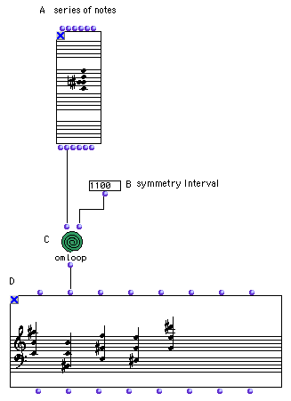
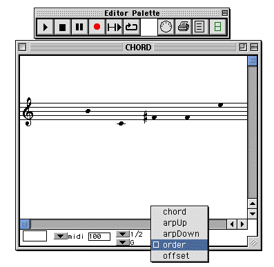
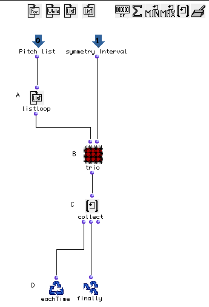
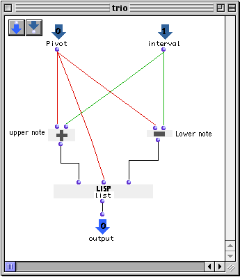

OpenMusic Tutorials  
---  
[Prev](tut.gen.15)| Chapter 5. Flow Control II: Loops|
[Next](tut.gen.17-18)  
  
* * *

# Tutorial 16: Introduction to [ omloop ](omloop) II

## Topics

Another example of using [ omloop ](omloop) with
[ listloop ](listloop)

## Key Modules Used

[ omloop ](omloop), [ list ](list), [ om+ ](omplus),
[ om- ](omminus)

## The Concept:

Using the [ omloop ](omloop) module, we will add an upper and a lower
harmony note to each note of a melody at a set interval.

## The Patch:

Edit your series in the [**Chord**](chord) object (A) after setting it to
order mode.

Choose an interval to use for the harmonizing. 1100 midics represents a major
seventh.

Add two inputs to omloop before opening its editing window (with option-
**->**. Then [ omloop ](omloop) and name these inputs as shown below.
(Again, naming inputs is not necessary, but it is practical, especially when
using complicated patches with many variables. Documenting your patches by
naming inputs and adding documentation in the input boxes is a good way to
keep track of data and patch functionality).

In order to enumerate each element of the list coming from the
[**Chord**](chord), we use [ listloop ](listloop) (A). Now create a
red patch (B). Notice that whenever a patch is created within a patch, this
patch appears as a red patch. Open it, add inputs and an output:

Coming into  _pivot_  , we will have an different enumerated note from the
melody at each repetition of the loop, while 'interval' is the interval we
chose, in midicents (in our example we chose 1100 midics). The
[ list ](list) function creates a new list by grouping its inputs
together and slapping on a new pair of parentheses. This is **different** than
[ x-append ](x-append), which merges two lists into one. Compare the two.
[ list ](list) will create a list with three midics, the first and last
being a major seventh above and below the middle.

The results will be collected using [ collect ](listing) and sent to the
output [ finally ](finaldo) (D). The output of [ omloop ](omloop)
will thus be a list of chords (a list of lists of midics, i.e. a tree of
midics) You can listen to the result in the [**Chord-seq**](chord-seq)
which is connected to [ omloop ](omloop)'s output.

* * *

[Prev](tut.gen.15)| [Home](index)| [Next](tut.gen.17-18)  
---|---|---  
Tutorial 15: Introduction to [ omloop ](omloop) I|
[Up](tut.gen.15-16)| Using Musical Objects II

