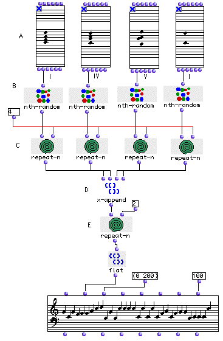

OpenMusic Tutorials  
---  
[Prev](tut.gen.17-18)| Chapter 6. Using Musical Objects II|
[Next](tut.gen.18)  
  
* * *

# Tutorial 17: Generation of a melodic sequence from harmonic reservoirs

## Topics

Generating a melodic sequence with elements of predetermined chords.

The idea of [_nesting_](glossary#NESTING).

## Key Modules Used

[ nth-random ](nth-random), [ x-append ](x-append),
[ flat ](flatlisp)

## The Concept:

We will generate a note sequence using four [**Chord**](chord) objects as
harmonic reservoirs. Each [**Chord**](chord) contain a traditional
harmonic chord structure. We will use [ nth-random ](nth-random) to
randomly choose notes from each reservoir, sequentially. We will concatenate
(put together!) the result with [ x-append ](x-append), preserving the
harmonic order of the reservoirs (I-IV-V-I).

## The Patch:

Enter the desired harmonic sequence in the [**Chord**](chord)s (A). In
this example we used the tonal sequence I-IV-V-I in C major scale.

Each [ nth-random ](nth-random) (B) will randomly pick a note in the
[**Chord**](chord) reservoirs.

We will 'iterate' (repeat) this procedure 4 times using
[ repeat-n ](repeat-n).

[ x-append ](x-append) (D) will concatenate these results in harmonic
order (i.e first we will have 4 randomly choosen notes from the first
reservoir, then 4 from the second one etc...).

In order to have this whole harmonic sequence repeat twice, we will again use
the [ repeat-n ](repeat-n) function (E). Notice that all these iterations
yield different results due to the fact that we are using [ nth-random ](nth-
random) function which is evaluated anew at each iteration (on the C and
D levels) and therefore returns different results each time.

Try this: evaluate the output of the [ repeat-n ](repeat-n) at (E). You
should get something like:

 ? OM->((6400 6700 6700 6700 7200 6000 6500 6500 5900 5900 6500 6700 6000 6000
7200 6000) (6700 6400 6700 7200 6900 7200 6000 6900 6500 5900 6500 5900 6000
6000 7200 7200)) 

Notice that this is a list of two lists. Plug this directly into the
 _lmidic_  input of the [**Chord-seq**](chord-seq) object. You'll get two
huge chords. This is because the list has multiple levels. When a list has
other lists as its elements, we say it is [nested](glossary#NESTING). A
tree is a nested list. When [**Chord-seq**](chord-seq) encounters a
nested list, it assumes the sublists are chords. In order to display this as a
string of ordered notes, we must 'flatten' the list. This is accomplished with
the LISP function [ flat ](flatlisp), which removes nesting. Reconnect
the output of [ flat ](flatlisp) to the [**Chord-seq**](chord-seq)
and evaluate.

|  **A note from Mikhail Malt**  
---|---  
 |

The old version of this patch (in a patchwork version) was a gift to Camilo
Rueda when he was at Ircam as a Patchwork developper. Just in order not to
break the Colombian tradition, this OM version is dedicated to Carlos Augusto
Agon, another nice Colombian guy working on Computer aided composition
environments.  
  
* * *

[Prev](tut.gen.17-18)| [Home](index)| [Next](tut.gen.18)  
---|---|---  
Using Musical Objects II| [Up](tut.gen.17-18)| Tutorial 18: Generation of
a note sequence by interpolation between two chords

