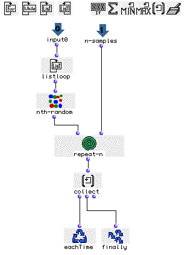

OpenMusic Tutorials  
---  
[Prev](tut.gen.17)| Chapter 6. Using Musical Objects II|
[Next](tut.gen.19-21)  
  
* * *

# Tutorial 18: Generation of a note sequence by interpolation between two
chords

## Topics

Using random elements and interpolation to generate a sequence of notes
between two harmonic areas.

## Key Modules Used

[`interpolation`](interpolation), [`omloop`](omloop),
[`repeat-n`](repeat-n), [`flat`](flatlisp), [**Chord**](chord),
[**Chord-seq**](chord-seq)

## The Concept:

In this tutorial as in previous ones, we will use randomly generated notes
from particular chords to construct a sequence. This time, however, these
chords are the result of an interpolation between two seed chords we choose.
The first chord is in the lower register, and the second is in the upper
register. The result of the interpolation will be an ascending sequence of
chords and so will be the general tendancy of our generated note sequence.

## The Patch:

We have choosen two chords of same density (i.e same number of notes) in
[**Chord**](chord) (A) and [**Chord**](chord) (B).

The module [`interpolation`](interpolation) (C) will interpolate between
these two chords using _n_ steps. In our example above we have chosen to
create 12 steps (chords A and B included). The last argument of interpolation
defines a curve for the calculation. A curve of 1 is linear, meaning that the
arithmetic midpoint of the interpolation will fall exactly 50% of the way
through the steps. In a non-linear interpolation specified by values smaller
than 1 (but greater than 0) or greater than 1, that midpoint will be displaced
towards the front or back of the sequence. This is easier to understand if you
can see it. Open the [**Chord-seq**](chord-seq) at (D) and check out the
interpolation with `_curve_` of 1.0:

Now, replace the `_curve_` argument of [`interpolation`](interpolation)
with .3 and evaluate. Notice that the intervals between chords are greater at
the beginning of the sequence. Now replace `_curve_` with 1.7 and reevaluate.
Notice how the large intervals are now towards the end of the sequence. Reset
`_curve_` to 1.0.

In order to apply the same process as in Tutorial 16, (picking _n_ random
samples from each chord of the interpolation) we will use
[`omloop`](omloop) (E):

In [`listloop`](listloop) will enumerate the elements of our
interpolation one by one for each repetition of the loop. [`nth-random`](nth-
random) will randomly choose one note of each of these chords. Connecting
[`nth-random`](nth-random)'s output to a [`repeat-n`](repeat-n)
module will repeat this _n_ times on each chord. Notice that
[`repeat-n`](repeat-n)'s second input is getting data from an additional
input that we named `_n-samples_` in order to choose the number of times we
want to sample each chord from outside omloop's editor window (in our example
it is 4 notes per chord, see the general patch). All results will be collected
by [`collect`](listing) and ouput by [`finally`](finaldo).

As in the last tutorial, the output of [`omloop`](omloop) will be a list
of lists equivalent to a list of chords when plugged into [**Chord-
seq**](chord-seq). In order to have a sequence of notes instead of
chords, we have to flatten the list with the function [`flat`](flatlisp).

* * *

[Prev](tut.gen.17)| [Home](index)| [Next](tut.gen.19-21)  
---|---|---  
Tutorial 17: Generation of a melodic sequence from harmonic reservoirs|
[Up](tut.gen.17-18)| Breakpoint Functions

