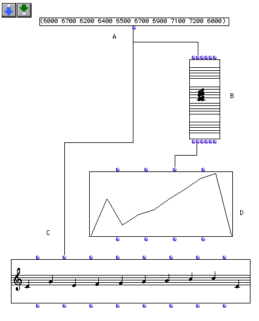

OpenMusic Tutorials  
---  
[Prev](tut.gen.19-21)| Chapter 7. Breakpoint Functions|
[Next](tut.gen.20)  
  
* * *

# Tutorial 19: Using BPFs I; Graphic representation of a series of notes

## Topics

Using a BPF (Breakpoint function) to analyze melodic contour.

## Key Modules Used

[ **BPF**](editors.bpf#BPF), [**Chord**](chord), [**Chord-
seq**](chord-seq)

## The Concept:

In this patch a series of values is used to produce a graphic representation
of a melody and a melody itself. The list of midics is passed to the
`_lmidic_` input of a [**Chord-seq**](chord-seq) object to view it as a
melody, as usual, but also to the `_y-points_` input of a
[**BPF**](editors.bpf#BPF) object, where it is converted into a graph (a
contour).

## The Patch:

Enter some values in midicents here at (A). Remember that in midicent-notation
C3 is equal to 6000, C♯3 is equal to 6100, and so forth.

The [**Chord**](chord) box can visualise these values either as a chord
or as a sequence ("order" mode). Evaluate the box and see the different types
of musical notation.

The [**Chord-seq**](chord-seq) box receives these midicent-values and
translates them into musical notation. Evaluate this box to see the musical
result.

The [**BPF**](editors.bpf#BPF) box translates the midicents into a break-
point function. On a grid with x and y axes, the graph of a break-point
function is a continuous line. (A break-point function can have at most one y
value for each x value. In graphic terms this means that a given vertical line
can only intersect the graph once. Evaluate the box to see the graphic
representation of your sequence of notes.

* * *

[Prev](tut.gen.19-21)| [Home](index)| [Next](tut.gen.20)  
---|---|---  
Breakpoint Functions| [Up](tut.gen.19-21)| Tutorial 20: Using
[**BPF**](editors.bpf#BPF)s II: Sampling a sequence of notes

