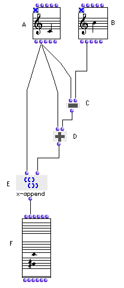
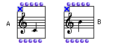

OpenMusic Tutorials  
---  
[Prev](tut.gen.1)| Chapter 1. Using Musical Objects I|
[Next](tut.gen.3.sgm)  
  
* * *

# Tutorial 2: Inverting an interval

## Topics

Changing the direction of an interval using arithmetic functions.

## Key Modules Used

[`om+`](omplus), [`om-`](omminus), [`x-append`](x-append)

## The Concept:

We'll take two pitches from two different [**Note**](note) objects. We'll
add their difference to the first one, reversing the direction of the
interval, and combine them into a list with [`x-append`](x-append). The
results will form a [**Chord**](chord).

## The Patch:

First, open the two [**Note**](note) box editors, and change the note, if
you want. You can do this either by dragging the note with the mouse, or by
clicking on it with the mouse so it is selected and using the cursor keys.
Holding shift while using the cursor keys moves the object by octaves.
Deleting notes is done by selecting them and hitting delete. Whatever notes
you choose, don't forget to make sure the boxes are locked (with the **b**
key) before continuing. Here are the notes by default:

With these values,

[ **Note**](note) (A) outputs 6000 as its midic. [**Note**](note)
(B) outputs 7100. The [`om-`](omminus) function (C) takes the difference
of the two: -1100. This is the number that must be added to the first
[**Note**](note) to reverse the direction of the interval, with
[`om+`](omplus) (D).

We need to combine these notes into a [**Chord**](chord) object. The
online documentation (see Quick Tour) tells us that the second input on a
[**Chord**](chord) object takes a list of midics. So, we combine the
original first [**Note**](note)'s pitch, 6000, and the result of our
calculation, 4900, into a list with the [`x-append`](x-append) function,
which takes any inputs and combines them into a single list. The resulting
pitch is displayed below.

* * *

[Prev](tut.gen.1)| [Home](index)| [Next](tut.gen.3.sgm)  
---|---|---  
Tutorial 1: Transposing pitches| [Up](tut.gen.1-9)| Tutorial 3: Building
a scale

