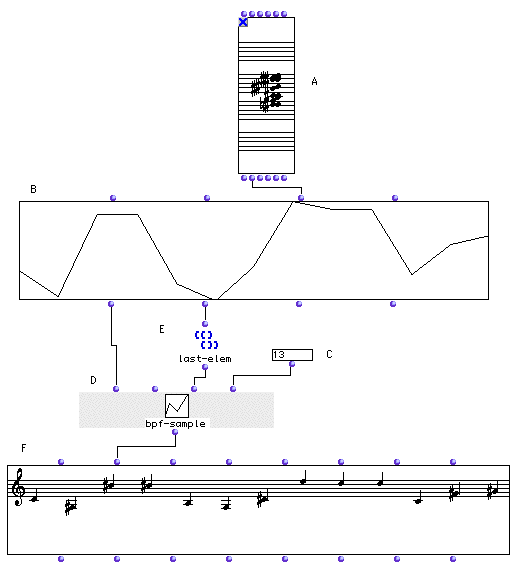
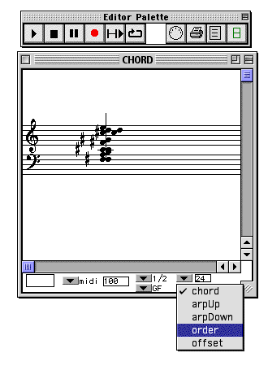

OpenMusic Tutorials  
---  
[Prev](tut.gen.19)| Chapter 7. Breakpoint Functions|
[Next](tut.gen.21)  
  
* * *

# Tutorial 20: Using [**BPF**](editors.bpf#BPF)s II: Sampling a sequence
of notes

## Topics

Sampling a melodic contour to produce a sequence of notes.

## Key Modules Used

[ **Chord**](chord), [**Chord-seq**](chord-seq),
[**BPF**](editors.bpf#BPF), [ bpf-sample ](bpf-sample), [ list-
max ](list-max)

## The Concept:

Here we sort of reverse the last tutorial: we take a melody, turn it into a
graphic melodic contour, then use [ bpf-sample ](bpf-sample) to take that
shape and turn it back into values. When converting it back to values, we can
take more or fewer samples than the original sequence, creating a "smoother"
melody.

## The Patch:

Enter a sequence of notes in "order" mode in the [**Chord**](chord) and
lock it:

The [**BPF**](editors.bpf#BPF) box converts the midicents coming out of
the [**Chord**](chord) box (A) into a break-point function, a melodic
contour.

The [ bpf-sample ](bpf-sample) takes a number of 'pictures' of the height
of the graph between the x-axis values specified at the inputs  _xmin_  and
 _xmax_  and returns them as a list. In our example, there are 13 elements in
the chord. We tell [ bpf-sample ](bpf-sample) to sample the
[ BPF ](editors.bpf#BPF) 13 times, so the values we get back will be the
same ones we put in. However, we are sampling the height of the graph. If we
enter a number other than 13, we will take that many samples of the graph, and
they'll no longer line up with the original elements. This will create a new
melody starting in the same place and having the same shape but with a
different number of elements. Try replacing the 13 with 26.

* * *

[Prev](tut.gen.19)| [Home](index)| [Next](tut.gen.21)  
---|---|---  
Tutorial 19: Using BPFs I; Graphic representation of a series of notes|
[Up](tut.gen.19-21)| Tutorial 21: Using [**BPF**](editors.bpf#BPF)s
III: Scaling a melodic contour

