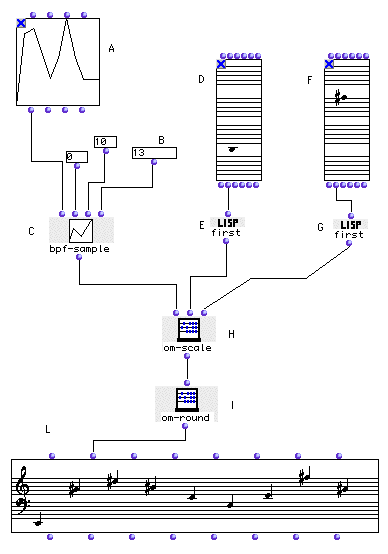

OpenMusic Tutorials  
---  
[Prev](tut.gen.20)| Chapter 7. Breakpoint Functions|
[Next](tut.gen.22-27)  
  
* * *

# Tutorial 21: Using [**BPF**](editors.bpf#BPF)s III: Scaling a melodic
contour

## Topics

Scaling a melody to fit within a given interval

## Key Modules Used

[ **BPF**](editors.bpf#BPF), [`bpf-sample`](bpf-sample),
[`first`](first), [`om-scale`](om-scale), [`om-round`](om-
round)

## The Concept:

Here we start with a [**BPF**](editors.bpf#BPF) object. We sample it at
as many points as we like with the [`bpf-sample`](bpf-sample) to create a
contour with _n_ elements (in this case, 13). These points are then scaled
with [`om-scale`](om-scale) to occur within the interval specified at its
`_minout_` and `_maxout_` outputs. We set these numbers using midic outputs of
[**Chord**](chord) objects; the result is that the melodic form occurs
between the two extremes.

## The Patch:

Open the [**BPF**](editors.bpf#BPF):

Here's a graphic editor for [**BPF**](editors.bpf#BPF) objects. You add
new points to the graph by using the Add Points Tool:

...and clicking on the graph. If you make a mistake, use the Select Points
Tool (first on palette) and select the points by clicking or dragging, then
hit delete.

Open the [**Chord**](chord) box (D) and enter one note. The note you
enter will be the lowest note of your melodic profile.

Open the [**Chord**](chord) box (F) and enter one note. The note you
enter will be the highest note of your melodic profile.

The midic outputs of the [**Chord**](chord) objects give a list of
midics. Even though they only contain one note, they still return that midic
in parentheses, a list of one element. To isolate this
[_atom_](glossary#ATOM) (single element) of the list, we use
[`first`](first), which takes the first (and only) element of these
lists. These midic values are passed to [`om-scale`](om-scale), which
adjusts the list at its first input such that the relative distance between
elements stays the same but the highest and lowest values come out to be the
inputs `_minout_` and `_maxout_`.

Note that the [`om-round`](om-round) box is technically superfluous; we
could have entered the result of [`om-scale`](om-scale) directly into the
[**Chord-seq**](chord-seq), which rounds pitches off for display anyway.
It does, however, make the pitches easier to read for humans. Compare the
output of the [`om-scale`](om-scale) function with the output of [`om-
round`](om-round).

* * *

[Prev](tut.gen.20)| [Home](index)| [Next](tut.gen.22-27)  
---|---|---  
Tutorial 20: Using [**BPF**](editors.bpf#BPF)s II: Sampling a sequence of
notes| [Up](tut.gen.19-21)| OM Music objects [**Chord-seq**](chord-
seq) and [**Voice**](voice)

