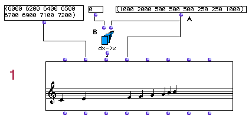
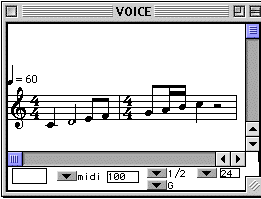
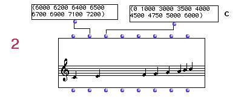
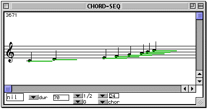
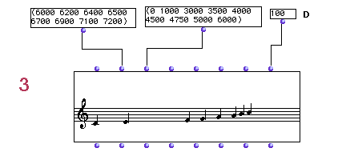

OpenMusic Tutorials  
---  
[Prev](tut.gen.22-27)| Chapter 8. OM Music objects [**Chord-seq**](chord-
seq) and [**Voice**](voice)| [Next](tut.gen.23)  
  
* * *

# Tutorial 22: [**Chord-seq**](chord-seq): Onsets and durations I

## Topics

Managing durations in the [**Chord-seq**](chord-seq) editor

## Key Modules Used

[ **Chord-seq**](chord-seq), [ dx->x ](dx-x), [ x->dx ](x-dx)

## The Concept:

In traditional music notation rhythm is represented as a single value (quarter
note, eighth note, etc...). These values don't tell the whole story, however.
The duration alone is not sufficient information when trying to place notes in
time. One also needs to know when in time these values happen. Metric
information consists then of two quantities:

 **Onsets** are the 'time addresses' of events. An onset represents the
absolute location of the beginning of a note measured from a fixed point, the
beginning of the sequence. In OM, onsets are always measured in milliseconds.

 **Durations** are the lengths of these events. A duration represents the
absolute length of note measured from the onset. In OM, durations are always
measured in milliseconds.

## The Patch:

Let's take the following list of durations:

(1000 2000 500 500 500 250 250 1000)

Which, if transcribed, could be represented by the following:

We will take this list of durations and connect it to the  _ldur_  input of a
[**Chord-seq**](chord-seq). These durations have to be converted into
onsets relative to the beginning of the sequence before they are given to the
 _lonset_  input. For this we use [ dx->x ](dx-x), which requires us to
tell it the absolute starting point, which in this case is 0ms, the beginning
of the sequence. This produces

(0 1000 3000 3500 4000 4500 4750 5000 6000)

which we pass to the [**Chord-seq**](chord-seq).

In example 2,

we will use this same list of onsets (C) as produced by [ dx->x ](dx-x).
We will not specify anything at the duration input. This will result in
'wrong' duration values, i.e all notes defaulting to a length of 1000
milliseconds. The sequence will thus have gaps or overlaps, as you can verify
in the editor:

Rather than calculate the durations, we can fix this by using the  _legato_ 
input. The legato input overrides the default durations. It is a value
representing a percentage of the perfect legato, with every note ending
exactly as the next note starts. If we enter 100 here we fix all the durations
of the sequence, as we've done in example 3:

Alternately, we could use the function [ x->dx ](x-dx) to turn the list
of onsets into a list of durations.

* * *

[Prev](tut.gen.22-27)| [Home](index)| [Next](tut.gen.23)  
---|---|---  
OM Music objects [**Chord-seq**](chord-seq) and [**Voice**](voice)|
[Up](tut.gen.22-27)| Tutorial 23: [**Chord-seq**](chord-seq): Onsets
and durations II

