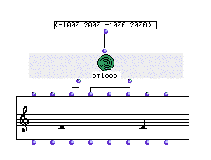
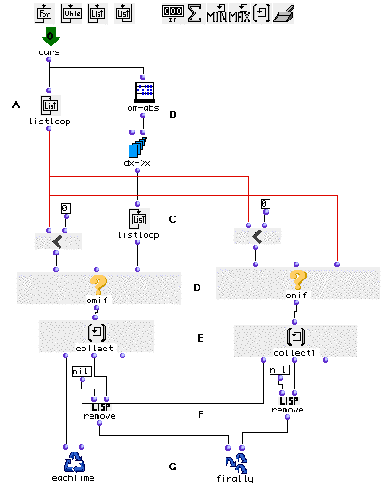
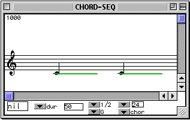

OpenMusic Tutorials  
---  
[Prev](tut.gen.22)| Chapter 8. OM Music objects [**Chord-seq**](chord-
seq) and [**Voice**](voice)| [Next](tut.gen.24)  
  
* * *

# Tutorial 23: [**Chord-seq**](chord-seq): Onsets and durations II

## Topics

Using rests in a list of durations for [**Chord-seq**](chord-seq).

## Key Modules Used

[ Chord-seq ](chord-seq), [ omloop ](omloop), [ omif ](omif),
[ dx->x ](dx-x), [ remove ](remove)

## The Concept:

In the last tutorial we learned more about the use of onset and duration
lists. These concerned only actual note durations. What if we wanted to use
rests or offset our entire rhythmic sequence by a certain amount? In this
tutorial we will demonstrate a practical way to deal with rest and note
durations in milliseconds, and this by using only one list of consecutive
durations and rests. All the programing will be done inside an
[ omloop ](omloop) method which will return correct onsets and durations
for use in a [**Chord-seq**](chord-seq)

[ **Chord-seq**](chord-seq) does not recognize negative numbers as rest.
The [ omloop ](omloop) will turn all the durations into offsets
(including the negative ones), and then remove the elements corresponding to
the negative durations so that only real notes will remain in the lists.

## The Patch:

We take a list of durations with negative numbers, which we will take to
represent rests. They are processed in an [ omloop ](omloop) module which
will output two lists for use at the  _ldur_  and  _lonset_  inputs of the
[**Chord-seq**](chord-seq) object.

The interior of our [ omloop ](omloop) looks like this:

Here's whats going on. This loop has two outputs (you add an output to
[ omloop ](omloop) by adding an _input_ to the [ eachTime ](loopdo)
and [ finally ](finaldo) functions. Stuff on the left is processing
onsets, stuff on the right is processing durations.

At (A), we use [ listloop ](listloop) to enumerate the elements of the
list of durations we gave the loop.

The [ om-abs ](om-abs) function at (B) returns the absolute value of a
number or list. It basically strips negative signs from numbers if they have
them. We put the list through this module before passing it to
[ dx->x ](dx-x) so that the rests can be incorporated correctly (they
still last a positive amount of milliseconds).

We will use two [ omif ](omif) boxes (D), one for onsets, the other for
durations. These will be used as filters: If an element of our list is less
than 0 (meaning it is a rest), both [ omif ](omif)s will return nil. If
not, the first [ omif ](omif) will return the onset time, the other the
duration.

All that's left to do is post-process both lists in order to remove the nil
elements, otherwise we cause an error. We do this with the
[ remove ](remove) function, which simply deletes all occurences of
something from a list. We tell it to delete all the nil elements.

The results are plugged into the  _ldurs_  and  _lonset_  inputs of the
[**Chord-seq**](chord-seq). We have two 2000ms notes separated by rests
of 1000ms:

* * *

[Prev](tut.gen.22)| [Home](index)| [Next](tut.gen.24)  
---|---|---  
Tutorial 22: [**Chord-seq**](chord-seq): Onsets and durations I|
[Up](tut.gen.22-27)| Tutorial 24: [**Voice**](voice) I

