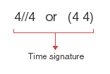
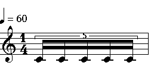

OpenMusic Tutorials  
---  
[Prev](tut.gen.23)| Chapter 8. OM Music objects [**Chord-seq**](chord-
seq) and [**Voice**](voice)| [Next](tut.gen.25)  
  
* * *

# Tutorial 24: [**Voice**](voice) I

Introduction to the [**Voice**](voice) object

## Topics

Introduces the concept of the rhythm tree.

## Key Modules Used

[ **Voice**](voice)

## The Concept:

The [**Voice**](voice) object incorporates traditional rhythmic notation.
Instead of working with onsets and durations, the rhythmic information in a
[**Voice**](voice) object is carried by a special type of tree called a
rhythm tree. Our goal in this patch is just to construct a simple rhythm tree
from scratch that will be acceptable to the [**Voice**](voice) box. **An
entire chapter is devoted to the concept of rhythm trees in the[Main
Section.](concepts.rhythm-trees)**

Consider the following example of a rhythm tree:

    
    
    (? (((4 8) ((4 (1 1 1 1)))) ((4 8) ((4 (1 1 1 1)))) ((4 8) ((4 (1 1 1 1))))))  
  
---  
  
While difficult to look at, the structure is actually quite logical:

### The rhythmic structure

  * The first element of the tree is a question mark '?', which is a placeholder for a certain number of measures. Rhythm trees get very complicated. The question mark tells OM to calculate the number of measures from the rest of the tree and replace the question mark with this value. It's a timesaver.

  * The second element of the tree is the rhythmic structure, in the form of a list of measures.

  * Each measure is itself a list containing two elements, a time signature and a list of proportions, representing the way the duration represented by that time signature is divided.

    * The first list, the time signature, can be represented in two different ways:

    * As a list (4 4) (meaning standard 4/4 time)

    * Or as a double-slashed fraction: 4//4

    * The second list, the list of proportions, determines the rythmic structure within the time signature.

The structure is again a list of lists where the first element is the number
of pulses contained in the measure followed by its subdivision. In the example
above, we have four equal pulses. We could have written

        
                (4 (3 1))  
  
---  
which represents a dotted half-note followed by a quarter note in a 4//4
measure.

### Rests

In the lists representing the subdivisions of the pulses, rests are
represented by negative numbers. For example,

    
    
    (? ( ((4 8) ((4 ( 1 -2 1)))) ) )  
  
---  
will output:

### Ties

By the same token, ties are represented by floats (decimals) as follows:

    
    
    (? ( ((4 8) ((4 ( 1 -2 1)))) ((3 4) ((3 (1.0 2)))) ) )  
  
---  
represents:

### Irrationals (tuplets)

Irrationals such as triplets, quintiplets etc. are quite easilt represented by
subdividing a pulse by an odd number. For instance, if we subdivide a pulse
into five beats (instead of four) we will obtain a quintuplet. Here is a pulse
divided into 4: the result is sixteenths:

    
    
    (?(((1 4) ((1 (1 1 1 1))))  ))  
  
---  
  

And the same pulse, this time divided into 5:

    
    
    (?(((1 4) ((1 (1 1 1 1 1))))  ))  
  
---  
  

## The Patch:

Here we'll just try to build a simple sequence of three measures of 4/8 with a
pattern of repeated eighth notes.

We'll 'reverse engineer' the rhythm tree. Since the tree is a nested list,
we'll build the individual elements using the [ list ](list) function
(and [ repeat-n ](repeat-n), where necessary) and pass those elements to
other [ list ](list) functions, making them sublists of a tree. So,
reading from the bottom up:

At (A) we add the first element, the question mark. Note that in the flow this
is actually the last thing we do.

At (B) is a [ repeat-n ](repeat-n) set to evaluate everything above it 3
times. These three lists thus created are our measures.

At (C) we construct the time signature as a list (4 8). It will be taken three
times by [ repeat-n ](repeat-n) as the first element of the measure.

At (D) another [ repeat-n ](repeat-n) producing

    
    
    (1 1 1 1)  
  
---  
is paired with a [ list ](list) function to great a group

    
    
    (4 (1 1 1 1))  
  
---  
. This group is passed to a further [ list ](list) function since it is
the only group in the measure (the measure in this case is a list of a single
group). This yields

    
    
    ((4 (1 1 1 1)))  
  
---  
, which is put with the time signature to compose the measures.

Evaluate the output at each point in the chain to see how the measures are
constructed.

* * *

[Prev](tut.gen.23)| [Home](index)| [Next](tut.gen.25)  

Tutorial 23: [**Chord-seq**](chord-seq): Onsets and durations II|
[Up](tut.gen.22-27)| Tutorial 25: [**Voice**](voice) II

