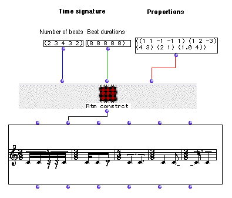
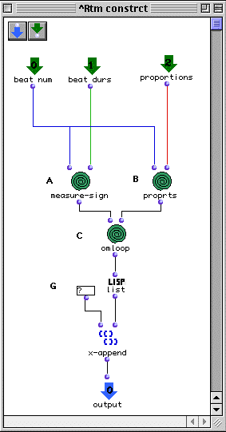
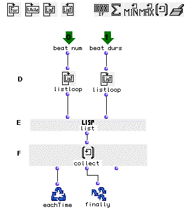
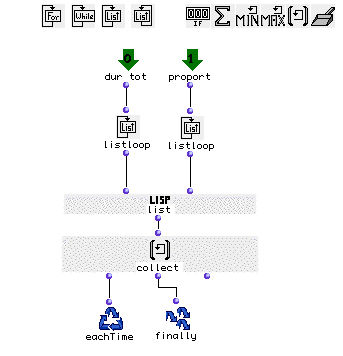
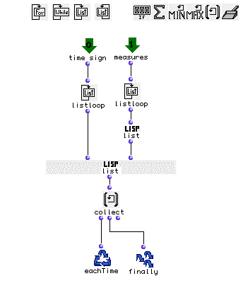
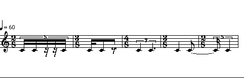

OpenMusic Tutorials  
---  
[Prev](tut.gen.24)| Chapter 8. OM Music objects [**Chord-seq**](chord-
seq) and [**Voice**](voice)| [Next](tut.gen.26)  
  
* * *

# Tutorial 25: [**Voice**](voice) II

More on rhythm trees

## Topics

Generating more complicated rhythm trees.

## Key Modules Used

[ **Voice**](voice), [`list`](list), [`x-append`](x-append),
[`omloop`](omloop)

## The Concept:

In this example, we will generate rhythm trees using an abstraction (red
patch) which we will call 'Rtm constrct'. This patch will take three
arguments, all of them lists. The first two lists will define the time
signature of each measure (the first being a list of numerators and the second
of denominators), and the third list will be the rhythmic structures contained
in these measures in the form of a list of lists.

## The Patch:

Here's the interior of the abstraction:

Inside this patch three [`omloop`](omloop)s will construct the 'leaves'
of our rhythm tree.

The first [`omloop`](omloop) will produce time signature:

Each output will be enumerated using [`listloop`](listloop) (D). Each
beat number will be appended to a list with its corresponding beat duration
using [`list`](list) (E). The results will be collected by
[`collect`](listing) (F) and then passed to the output.

At (B), 'proprts' will return measures. (This loop is the same as 'measure-
sign' loop, except that it pairs the measure lengths (time signature
numerators) with the lists of rhythmic structure.

At (C), another [`omloop`](omloop) will take the elements of the lists
produced by the other [`omloop`](omloop)s and pair them off to form the
measures. **Note that we must put each of the measure lists into another set
of parentheses with[` list`](list) because each measure must be a list of
groups and we only have one group per measure.**

Outside of the [`omloop`](omloop)s at (G) we add the obligatory question
mark, which we append to the list with [`x-append`](x-append).

After connecting our abstraction to the second input of the
[**Voice**](voice), we will obtain this rhythm:

* * *

[Prev](tut.gen.24)| [Home](index)| [Next](tut.gen.26)  
---|---|---  
Tutorial 24: [**Voice**](voice) I| [Up](tut.gen.22-27)| Tutorial 26:
Editing rhythm with the [**Voice**](voice) graphic editor

