OpenMusic Documentation  
---  
[Prev](tut.gen.25.html)| Chapter 8. OM Music objects [**Chord-seq**](chord-
seq.html) and [**Voice**](voice.html)| [Next](tut.gen.27.html)  
  
* * *

# Tutorial 26: Editing rhythm with the [**Voice**](voice.html) graphic editor

## Topics

In this tutorial we will use an excerpt from the Chorale _Allein Gott in der
Hh' sei Ehr'_ from J.S. Bach's German Organ Mass to learn how to enter rhythm
when working in the [**Voice**](voice.html) editor, a new addition to OM 4.4,
developed by Carlos Agon.

## Key Modules Used

[ **Voice**](voice.html)

## The Concept:

|  **If you work in Finale**  

While it is possible to edit musical objects in OM, if you are a Finale user,
it is often faster to use OM's import and export capabilites to move objects
back and forth between OM and Finale, since Finale's editing interface remains
slightly more fluid. See the Function References on [ finale-export ](finale-
export.html) and [ finale-import ](finale-import.html).  
  
The goal is to recreate the following 5 measures from the Chorala:

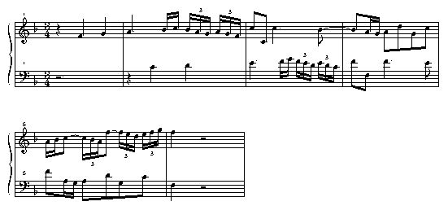

We will create both staves separately in two different [**Voice**](voice.html)
editors and then combine the results into a [**Poly**](poly.html) object. A
[**Poly**](poly.html) object is quite simply a stack of
[**Voice**](voice.html) objects. Its second input takes a list of
[**Voice**](voice.html) objects, which can then be played and edited together.

## The Patch:

First, let's look at the [**Voice**](voice.html) editor window:

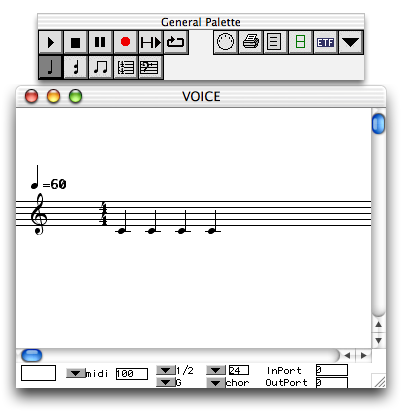

As with all editors, there are a series of buttons which control which what
level we're editing on:

  * 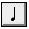 Note mode - used to edit individual notes of the sequence.

  * 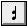 Chord mode - used to edit the [**Chord**](chord.html)s of the sequence.

  *  Group mode - used to edit rhythmic groups within measures of the sequence.

  * 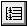 Measure mode - used to edit entire measures of the sequence.

  * 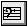 Voice mode - used edit the whole [**Voice**](voice.html) at once.

  *  Poly mode - This button is only present in [**Poly**](poly.html) editors, and allows you to simultaneously edit the stack of [**Voice**](voice.html)s all at once.

These editing levels respect the natural heirarchy of OM objects, following a
pattern of inheritance mentioned in the previous tutorials. When creating
rhythms from scratch in OM, its best to use a strategy which respects this
heirarchy:

  * First, change the time signature.

  * Second, create new measures.

  * Third, enter notes representing the basic rhythmic groups.

  * Fourth, subdivide those notes as necessary

  * Lastly, change pitches.

### The time signature

In order to change the time signature we must select the measure mode as shown
above. When this is done, two fields are shown in the palette, the numerator
and denominator of the time signature:

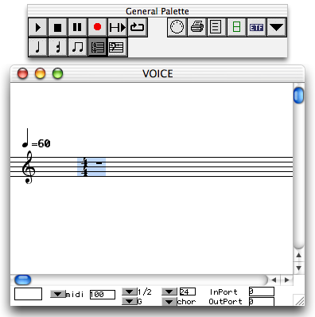

You enter the time signature by clicking on the numbers and dragging up or
down. Then click set:

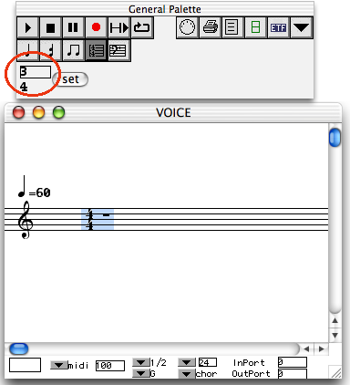

### Adding new measures

Adding new items in general is done by holding option and clicking, and
measures are no exception. With the measure tool still selected, option-click
four times to the right of the existing measure to add new blank ones.

You may get a pop-up help screen at any time by hitting **h** :

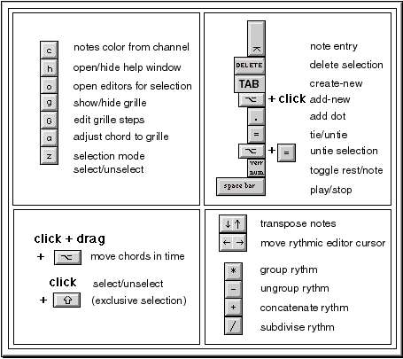

This menu lists the available commands. **Some have not yet been implemented.
In addition, some of the commands are only applicable when you are in edit
mode (represented by a green or red box cursor - more on this below).**
Eventually someone will update this help screen.

### Creating the basic rhythmic structure

Next, we create a basic rhythmic structure representing the note groupings of
the measure, which we will then subdivide to create the appropriate number and
type of notes. For the upper voice of the Chorale, the basic rhythmic
structure will be:

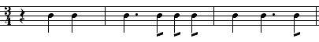

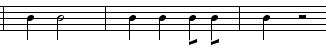

...whose notes we will then subdivide to create the finished rhythmic
structure:

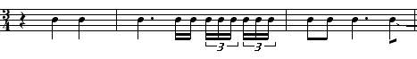

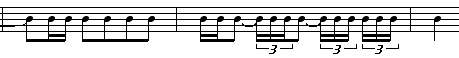

In addition to the various editing modes chosen with the tool buttons of the
palette, there are two different cursor modes when editing. The default is the
selection mode, which is available in all the tools. When in selection mode,
objects that you click on or drag to enclose are highlighted in blue. The
second mode is the edit mode, which is available only in the Note, Chord, and
Group tools. You enter edit mode by option-clicking on or in between notes. A
cursor appears, surrounded by a red box (if you are between notes, going to
enter new ones) or a green box (if you clicked on a note, you're going to
change the note)

When in the edit mode, the cursor keys move you to the next/previous object,
(with a green cursor) and the tab key moves you to the space between the
current object and the next one (with a red cursor).

Click the Chord tool and option-click before the first rest of the first
measure. You enter edit mode and the red cursor appears:

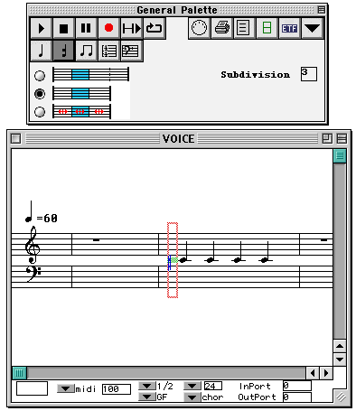

You'll also notice three radio buttons appear on the palette. These buttons
control the behavior of the measure when you enter new notes. They are, from
top to bottom, Replace Notes, Extend Measure, and Keep Proportional Lengths.

To demonstrate how these work, we'll start with a hypothetical measure of 3/4
containing 3 quarter notes:

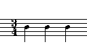

We will put the red cursor in front of the first note and type **6** , which
will normally inserts a half-note.

In Replace Notes mode, the half note pushes the last two quarter notes out of
the measure, deleting them. The measure length stays the same and the half
note is entered:

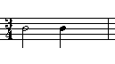

In extend measure mode, the half note is added and the time signature is
adjusted in order to accomodate the new note. The result is a bar of 5/4:

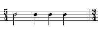

In Keep Proportional Lengths mode, no notes are deleted but the time signature
does not change either. The proportions of the notes are kept the same
relative to each other but they are adjusted as a group to fit in the measure.
This usually results in the creation of a tuplet of some kind:

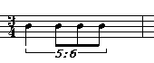

For our purposes, we want the first mode, Replace Notes.

When in edit mode, the notes of the keypad correspond to durations. They will
add notes if you are between notes (red cursor) or change durations of notes
if you are on a note (green cursor). They work as follows:

 |
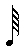  
---|---  
 |
  
 |
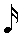  
 |
  
 |
  
 |
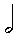  
 |
  
  
#### First Measure

In edit mode, use **5** to enter a quarter note.

Hit tab (not the arrow keys) to move to the next insert point.

Insert a second quarter note.

Hit tab again to get to a new position

Insert a third quarter note.

Now, we need to change the first quarter note into a rest. Use ← to move the
green cursor back to it:

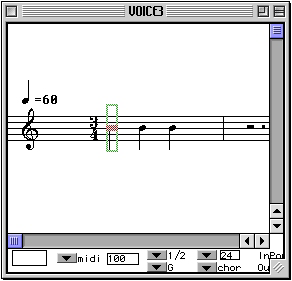

...then hit screen lock on the keypad. Powerbook users can use function-clear
(function-6).

#### Second Measure

Move the cursor to the last note of measure 1 with right arrow. Then hit tab
to get it to the space before the beginning of measure 2.

Using tab between notes again, enter a quarter note and three eighth notes
using 5 4 4 4.

Our measure now looks like:

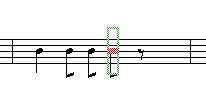

Use left arrow to move the cursor back to the first note. Hit **.** (period)
to add a dot.

### Subdividing the structure

Now we need to subdivide these notes into the groupings of the Chorale. Come
out of edit mode by clicking anywhere else in the window. Then click on the
first eighth note. The note turns blue (you are in selection mode) Hit **2**.
**When you hit a number key in selection mode, you subdivide the selected
note(s) evenly.** Hitting **2** on an eighth note changes it into two
sixteenths. Click on the next eighth, then shift-click on the last eighth.
They are both blue. Hit **3** to turn them both into triplet sixteenths.

The opposite of this operation is performed with + CLASS="KEYCAP" >+**. Select
the notes you want to "put back together" and hit + CLASS="KEYCAP" >+** to
regroup them.

Ties are added in selection mode by hitting **=** with the two notes selected,
or in edit mode with the first note of the tie in the green cursor.

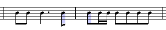

### Entering pitches

Pitches are entered by dragging notes or groups of notes with the mouse or
selecting them and using the cursor keys. Holding shift while using the cursor
keys moves them by octaves.

You can control how enharmonics are spelled in the Preferences pane:

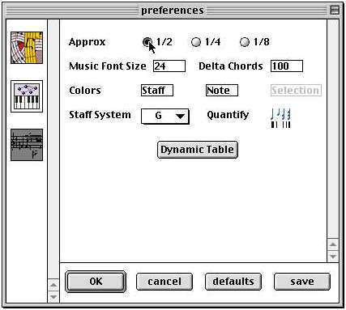

Double-click the 1/2 button to bring up the enharmonic alterations editor:

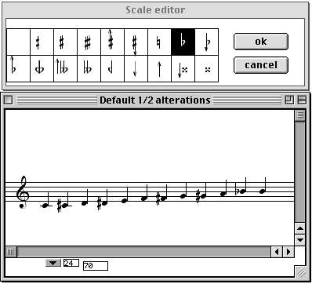

This is where you choose how you want OM to display certain midic values.
Select the A sharp; and type o. The scale editor window opens. Select the
flat; from the list. The A sharp; becomes an A flat;. Select it and hit the
uparrow key so that it becomes a B flat. After closing this panel don't forget
to hit OK in the main Pane.

Now all A sharps will be notated as B flats

Using the same procedure, enter the lower voice in the other
[**Voice**](voice.html) box. When you are done, make sure they are both
locked, and evaluate the [**Poly**](poly.html). You will create a two-voice
object containing both [**Voice**](voice.html)s.

* * *

[Prev](tut.gen.25.html)| [Home](index.html)| [Next](tut.gen.27.html)  
---|---|---  
Tutorial 25: [**Voice**](voice.html) II| [Up](tut.gen.22-27.html)| Tutorial
27: Introduction to rhythm quantification

