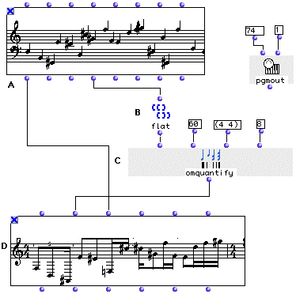
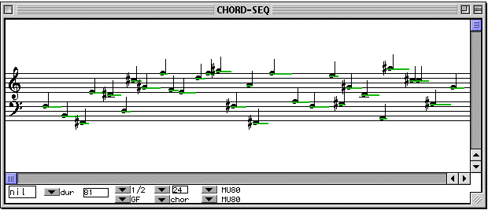
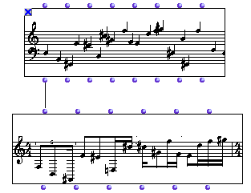
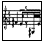
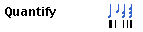
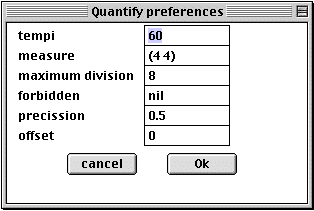
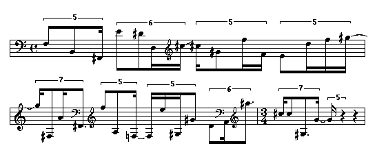
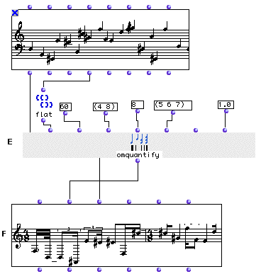
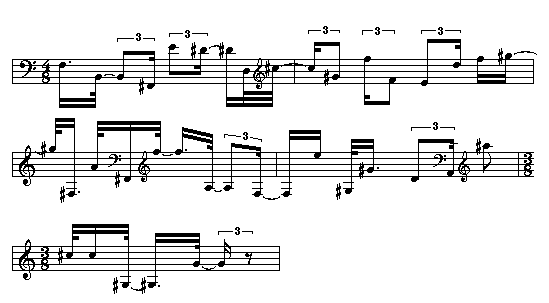

OpenMusic Tutorials  
---  
[Prev](tut.gen.26)| Chapter 8. OM Music objects [**Chord-seq**](chord-
seq) and [**Voice**](voice)| [Next](tut.gen.28-29)  
  
* * *

# Tutorial 27: Introduction to rhythm quantification

## Topics

Converting lists of durations into traditional rhythmic notation; passing data
between [**Chord-seq**](chord-seq) nad [**Voice**](voice).

## Key Modules Used

[`om-quantify`](omquantify), [**Voice**](voice),
[`flat`](flatlisp)

## The Concept:

The [`omquantify`](omquantify) function converts a list of durations, in
milliseconds, into a rhythm tree (treating positive integers as durations and
negative integers as rests). In this example we will quantify a [**Chord-
seq**](chord-seq) (A) from Tutorial 13 using two different settings.
Remember that [**Chord-seq**](chord-seq) does not recognize negative
integers as rests; its `_ldur_` output is simply the durations of the notes,
without regard for where they fall. The [`omquantify`](omquantify)
function treates the duration list as consecutive durations that are 'flush'
with each other. If ther are gaps in the original [**Chord-seq**](chord-
seq), then, the transcription will not be accurate.

As described further down, there is another way to transmit data from a
[**Chord-seq**](chord-seq) to a [**Voice**](voice); this is to plug
the `_self_` output of the [**Chord-seq**](chord-seq)into the `_self_`
input of the [**Voice**](voice). This method has the advantage of
preserving the real start times (onsets) of all notes regardless of whether
they are 'flush' with their neighbors. However, each note is transcribed to
last until the onset of the next; i.e. the transcription will not have any
rests.

## The Patch:

In order to quantify from a [`Chord-seq`](chord-seq), we will use the
list of durations that we get evaluating its fourth output, `_ldur_`. Each of
these durations corresponds to a note in the [**Chord-seq**](chord-seq).
In some cases there might be rests in the sequence. As mentioned above, using
this method (using only the `_ldur_` output of [`Chord-seq`](chord-seq))
we will get an inaccurate result. Therefore we will check the [**Chord-
seq**](chord-seq) (A) in its editor and select the dur item from the pop-
up menu. We verify that all notes fall one after another (are 'flush' with
each other) forming a monodic sequence without rests:

We will then connect the fourth output `_ldur_` of the [**Chord-seq**](chord-
seq) (A) to [`flat`](flatlisp) (B) in order to get a simple list of
durations.

[`flat`](flatlisp) (B) is connected to the first input of
[`omquantify`](omquantify) (C). At the second input we will enter 60
indicating a tempo for the transciption. The third input is for the time
signature. The fourth input is the maximum limit (exclusive) of for
subdividing the pulse, in this case, by 8, or into 32nd notes.

As mentioned above, you can connect a [**Chord-seq**](chord-seq) directly
to a [**Voice**](voice) via the `_self_` input:

In this case, an [`omquantify`](omquantify) is automatically performed on
the material. The settings for this automatic [`omquantify`](omquantify)
are in the [Preferences Pane](concepts.preferences). Click the icon:

and then the quantify icon:

A preferences panel appears where you can edit the default settings:

If we connect our [**Chord-seq**](chord-seq) directly to the `_self_`
input of the [**Voice**](voice):

We get the following transcription with the defaults:

In the bottom half of the patch window, we clean up the transcription by
adjusting some settings with the additional inputs (added with option- **->**
) of [`omquantify`](omquantify):

You'll often have to fool around with tempo and time signature settings before
you get a decent transcription out of [`omquantify`](omquantify). In the
example above we have used the fifth and the seventh optional inputs of
[`omquantify`](omquantify). The fifth input, `_forbid_` is a list of
forbidden subdivisions of the pulse (here quintuplets, sextuplets and
septuplets are forbidden). The seventh input, `_precis_` , is a level of
precision, which is a value between 0 and 1, inclusive. 1 is the highest level
of precision, with accurate but complicated results. 0 is the least precise,
yielding simple but less accurate results. In our case, we changed the time
signature to (4 8). We did this so that the unit of the pulse would be the 8th
note and the smallest permitted division (which is 8) is thus equal to a 64th
note. If your settings don't allow room for the smallest note values of the
original, [`omquantify`](omquantify) may drop some notes, but it always
lets you know in the Listener:

`? Warning: with the given constraints, 5 notes are lost while quantizing `

Our new transcription is:

* * *

[Prev](tut.gen.26)| [Home](index)| [Next](tut.gen.28-29)  
---|---|---  
Tutorial 26: Editing rhythm with the [**Voice**](voice) graphic editor|
[Up](tut.gen.22-27)| Playing MIDI II

