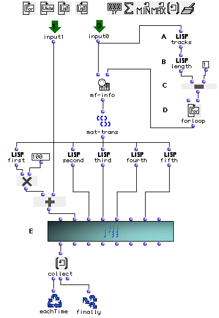

OpenMusic Tutorials  
---  
[Prev](tut.gen.28-29)| Chapter 9. Playing MIDI II|
[Next](tut.gen.29)  
  
* * *

# Tutorial 28: Working with MIDI files I

Transposition

## Topics

Converting a **Midifile** into a [**Chord-seq**](chord-seq) after
transposing its notes.

## Key Modules Used

[ mf-info ](mf-info), [ mat-trans ](mat-trans),
[ omloop ](omloop), [ save-as-midi ](save-as-midi)

## The Concept:

Converting a **Midifile** into a [**Chord-seq**](chord-seq) can be done
immediately by patching the  _self_  output of the file into the  _self_ 
input of the [**Chord-seq**](chord-seq). Indeed, the [**Chord-
seq**](chord-seq) class will inherit all its elements from the
**Midifile** , which will be converted into appropriate data by the internal
[_methods_](glossary#METHOD) of the [**Chord-seq**](chord-seq) . For
instance, standard MIDI notes from the **Midifile** will be multiplied by 100
in order to be handled correctly by a [**Chord-seq**](chord-seq).
However, if you want to modify this data before transcription, you must use
the [ mf-info ](mf-info) function to analyze the **Midifile** so that you
can work with its elements. [ mf-info ](mf-info) takes a **Midifile** and
returns a tree where each channel is a list of notes, and each note is itself
a list of five values: midi note number, onset, duration, velocity, and MIDI
channel. You notice these are the same quantities used by [**Chord-
seq**](chord-seq) to keep track of its notes.

## The Patch:

A MIDI file is dragged onto a patch. This will create a **Midifile** factory.
Connect its output to [ mf-info ](mf-info).

In order to work on a particular track, we must know the exact number of
tracks in the MIDI file. Since each track is a sublist of the master list,
evaluating with [ length ](length) will return the number of tracks (here
2). Opening the optional input of [ mf-info ](mf-info), we can choose to
gather data from a particular track (instead of the whole file. The first
track is numbered zero.

The track is a list of lists, each containing the five parameters describing a
note. We use the [ mat-trans ](mat-trans) function to transform this list
of lists such that the new lists are groupings of the _n th_ element of the
old lists. See the Reference for more information. The result of this will be
a new list of lists, except that each list now represents a single parameter,
with values for all the notes of the file.

We separate these parameter lists with the LISP functions
[ first ](first), [ second ](second), and so on. The first sublist
is a list of all the first elements of the old tree (i.e. all the MIDI note
numbers.) In order to convert MIDI notes to midicents, one must multiply them
by 100 using [ om* ](ommultiply) at (E). We transpose them up 200
midicents at (F), and pass the result along with the other parameter lists to
[**Chord-seq**](chord-seq) at (G)

We can write a loop that will do this for all the elements of a file:

with [ omloop ](omloop) structured as follows:

Inside [ omloop ](omloop) we have reproduced the main patch as it was
shown earlier adding an iterative procedure using the
[ forloop ](forloop) (D) iterator. [ forloop ](forloop) controls the
loop by using a variable which is augmented by a certain amount at each
repetition of the loop. [ forloop ](forloop) stops repetition when this
value equals a certain threshhold.

[ forloop ](forloop) is setup to run from zero to the number of tracks-1
(since the first track is called zero). The iterator itself outputs the
current value of the variable. It will thus output 0 on the first repetition
and 1 on the second and last. This value is used in [ mf-info ](mf-info)
to isolate a particular track for the transposition process.

* * *

[Prev](tut.gen.28-29)| [Home](index)| [Next](tut.gen.29)  
---|---|---  
Playing MIDI II| [Up](tut.gen.28-29)| Tutorial 29: Working with MIDI
files II

