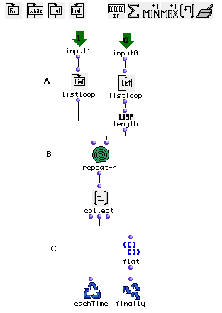

OpenMusic Tutorials  
---  
[Prev](tut.gen.28)| Chapter 9. Playing MIDI II|
[Next](tut.gen.30-31)  
  
* * *

# Tutorial 29: Working with MIDI files II

Channel parsing

## Topics

Converting a standard **Midifile** into a [**Chord-seq**](chord-seq) with
correct microintervals.

## Key Modules Used

 **Midifile** , [ omloop ](omloop), [ omif ](omif),
[ repeat-n ](repeat-n)

## The Concept:

Most commercial MIDI sequencers don't support microintervals. When working
with these environnments, one must use a multichannel setup in order to
simulate microintervals, by "pitchbending" certain channels as is done
automatically in Openmusic. In this tutorial we will show how to convert one
of these MIDI files into a [ Chord-seq ](chord-seq) which will play
correct microintervals.

## The Patch:

In our example we have created a simple multitrack MIDIfile. It represents a
chromatical segment of a quarter-tone scale starting from C3. The first MIDI
track is on channel 1 which is the normally tuned track; The second is on the
channel 2, which shouold be tuned 1 quartertone higher. We need to get these
notes back onto a single channel and adjust their midics to reflect the
detuning of the other channels in the MIDI file.

At (A) the MIDIfile is opened (or dragged into an OpenMusic patch).

Each color represents a different MIDI channel. (Here blue is channel 1 and
green is channel 2)

Now if we open the [**Chord-seq**](chord-seq) (B) editor and check the
chan popup menu, we can see each note's channel.

In the first [ omloop ](omloop) (C) we will use [ omif ](omif) to
'correct' each note, and turn it into the right pitch, by checking to see
whether the channel equals 2. Note that we use two [ listloop ](listloop)
boxes to enumerate the MIDI notes and the channel assignments simultaneously.

In this case our line is of single notes. If there had been chords we would
have needed to process the onset times and assign the same onset time to every
note of the chord. This is done with the [ omloop ](omloop) below:

The  _ldur_  output is a list of lists. Each integer is a duration of a single
note, so all we have to do is flatten the list using [ flat ](flatlisp).

All this results in the following:

Each note is correctly parsed to the right channel according to its tuning.

* * *

[Prev](tut.gen.28)| [Home](index)| [Next](tut.gen.30-31)  
---|---|---  
Tutorial 28: Working with MIDI files I| [Up](tut.gen.28-29)| Using
Musical Objects I

