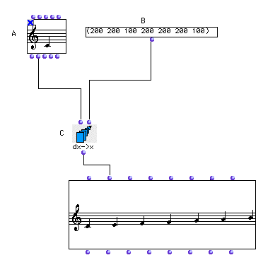

OpenMusic Tutorials  
---  
[Prev](tut.gen.2)| Chapter 1. Using Musical Objects I|
[Next](tut.gen.4.sgm)  
  
* * *

# Tutorial 3: Building a scale

## Topics

Constructing a scale using the [`dx->x`](dx-x) function.

## Key Modules Used

[ **Note**](note), [**Chord-seq**](chord-seq), [`dx->x`](dx-x)

## The Concept:

Here we use [`dx->x`](dx-x) to build a scale. [`dx->x`](dx-x) takes
a list of relative quantities and changes them into absolute quantities
starting from a point we define. In this case, we'll use it to define a scale
(which is, after all, a set of relative intervals) which we can then build on
any note.

## The Patch:

Open the NOTE box (A) and pick the note from which you would like your scale
to begin. Then lock it.

Enter a list of intervals in this box in order to construct a scale. Remember
that an interval of 100 is equal to a semitone. In the example we've entered a
major scale.

In the example, the [**Note**](note) outputs 6000 as its midic. The
[`dx->x`](dx-x) function starts with 6000 and adds, sequentially, the
elements at its second input. This list of midics is put into the `_lmidic_`
input of the [**Chord-seq**](chord-seq) object. Remember, you can see the
names of the inputs by command-clicking on the inputs themselves.

Evaluate the [**Chord-seq**](chord-seq) box to see your scale starting on
your note.

* * *

[Prev](tut.gen.2)| [Home](index)| [Next](tut.gen.4.sgm)  
---|---|---  
Tutorial 2: Inverting an interval| [Up](tut.gen.1-9)| Tutorial 4:
Inverting an interval II

