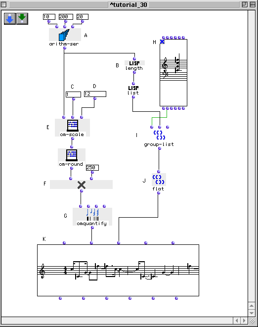
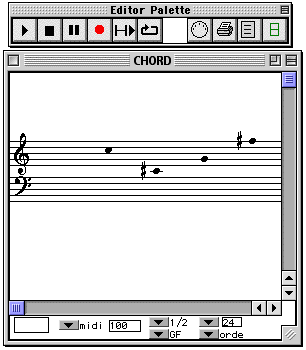

OpenMusic Tutorials  
---  
[Prev](tut.gen.30-31)| Chapter 10. Using Musical Objects I|
[Next](tut.gen.31)  
  
* * *

# Tutorial 30: Working with lists I

Generating lists of identical length

## Topics

Creating rhythm from arithmetic series and "filling" it with notes from a
chord.

## Key Modules Used

[ arithm-ser ](arithm-ser), [ group-list ](group-list),
[ flat ](flatlisp), [ length ](length), [ om-round ](om-round),
[ om-scale ](om-scale), [ omquantify ](omquantify)

## The Concept:

This example creates a list of notes (L) containing the same number of
elements as a list of durations (I) which are derived from an arithmetical
series (A).

## The Patch:

The [ arithm-ser ](arithm-ser) box (A) creates an arithmetical series
going from 10 to 200 by steps of 20.

The values you enter at (C) and (D) will correspond to the shortest and
longest durations in your rhythmic sequence (They are of course arbitrary
numbers which will be scaled afterwards).

Lets say that we want to build our rhythms with the sixteenth as the smallest
unit. We'll generate a scaled series and multiply it by 250, which will be a
sixteenth note at the quarter note=60 tempo of the transcription. The module
[ om-scale ](om-scale) (E) scales the values coming out of the [ arithm-
ser ](arithm-ser) box (A) so that the series runs between the values
entered in inputs (C) and (D). In order to round off the result we will use
[ om-round ](om-round). This way we are sure to have integers going from
1 to 12. These integers are multiplied by 250 to yield a list of durations
which are passed to [ omquantify ](omquantify).

Our harmonic material is in the form of a chord:

Obviously we need to reuse notes if we want to create a list as long as the
elements of our rhythmic series. Here we use a trick to get a list of exactly
the right length. The module [ group-list ](group-list) puts the elements
of a series into groups according to its second input. The third input is a
little pull-down menu where you an set the mode to  _linear_  or  _circular_ .
In linear mode, the function stops when it runs out of notes. However, if we
set it to  _circular_  , it will start again at the beginning of the list as
many times as necessary. We give it the list of midics at the first input. It
expects a list of group lengths at the second input. We take the length of the
rhythmic series and make a list of one element out of it. In this way,
[ group-list ](group-list) will generate a list of exactly the right
length to accompany our rhythm. We need to [ flat ](flatlisp)ten it
before passing to the [**Voice**](voice).

Try changing the values of the original [ arithm-ser ](arithm-ser) and
evaluate the results.

* * *

[Prev](tut.gen.30-31)| [Home](index)| [Next](tut.gen.31)  
---|---|---  
Using Musical Objects I| [Up](tut.gen.30-31)| Tutorial 31: Working with
lists II

