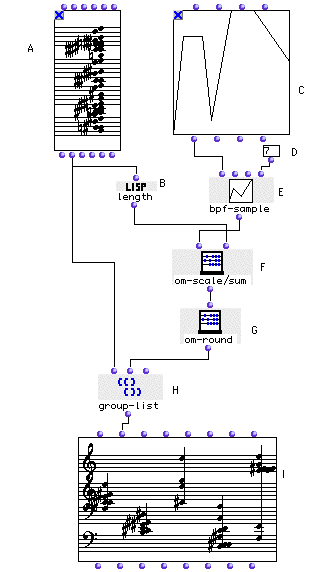

OpenMusic Tutorials  
---  
[Prev](tut.gen.30)| Chapter 10. Using Musical Objects I|
[Next](tut.gen.32-33)  
  
* * *

# Tutorial 31: Working with lists II

Grouping lists

## Topics

Using [`group-list`](group-list) to create chords based on a density
contour.

## Key Modules Used

[ **BPF**](editors.bpf#BPF), [`bpf-sample`](bpf-sample), [`group-
list`](group-list), [`om-round`](om-round), [`om-scale/sum`](om-
scalesum)

## The Concept:

Here we use [`bpf-sample`](bpf-sample) as we did in [Tutorial
21](tut.gen.21) to transform a [**BPF**](editors.bpf#BPF) into
values. This time, however, the values of the [**BPF**](editors.bpf#BPF)
will represent the density of chords, not the notes. We use the [`group-
list`](group-list) function, demonstrated in the previous tutorial, to
break down a master [**Chord**](chord) object into a list of
[**Chord**](chord)s following the density contour of the
[**BPF**](editors.bpf#BPF).

## The Patch:

Here's a schematic of the patch:

The input (D) will decide how many child [**Chord**](chord)s we want to
create. In the example, we take 7 samples of the
[**BPF**](editors.bpf#BPF) in the range of x-axis values between 10 and
100. We will ultimately use [`group-list`](group-list) to split the
master [**Chord**](chord) apart. The problem is that the values of the
samples of the [**BPF**](editors.bpf#BPF) total many more notes than are
available in the [**Chord**](chord). We need to scale this list of
samples, but not as we've scaled things in the past, because it is not the
bounds of the series we are concerned with but the _sum_. We use a different
function, [`om-scale/sum`](om-scalesum), which adjusts the series of
samples so that their sum is equal to the number of elements in the master
[**Chord**](chord).

The next problem is that [`group-list`](group-list) needs a list of whole
numbers to determine how many notes it will put in each group. We solve this
by rounding the list off with [`om-round`](om-round). The result is that
the master [**Chord**](chord) is broken up into a series of elements with
densities based on the [**BPF**](editors.bpf#BPF), which you can verify
by drawing a new figure in the [**BPF**](editors.bpf#BPF) editor.

* * *

[Prev](tut.gen.30)| [Home](index)| [Next](tut.gen.32-33)  
---|---|---  
Tutorial 30: Working with lists I| [Up](tut.gen.30-31)| The Maquette

