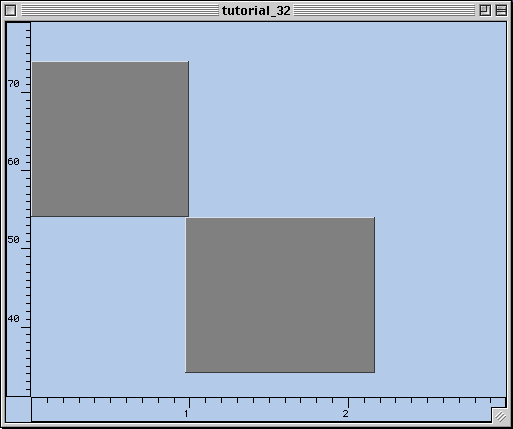
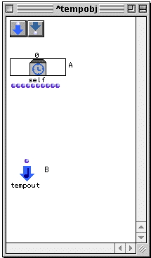
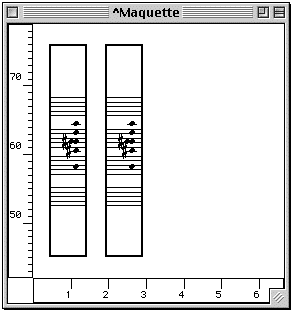
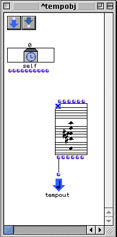
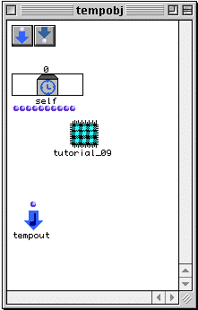
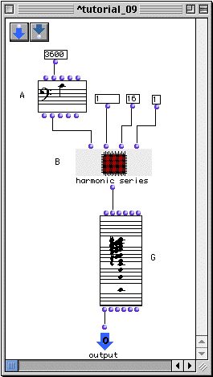
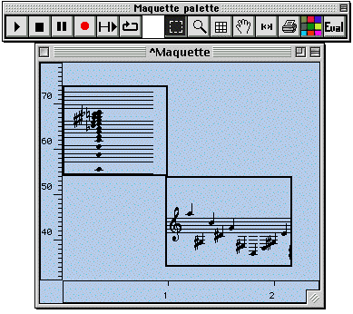
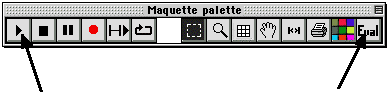

OpenMusic Tutorials  
---  
[Prev](tut.gen.32-33)| Chapter 11. The Maquette| [Next](tut.gen.33)  
  
* * *

# Tutorial 32: Introduction to the [**Maquette**](glossary#MAQUETTE) I

## Topics

The [**Maquette**](glossary#MAQUETTE) and
[**Temporalbox**](temporalbox) objects. The difference between red and
blue patches.

## Key Modules Used

[ **Maquette**](glossary#MAQUETTE), [**Temporalbox**](temporalbox),
red and blue patches.

## The Concept:

The [**Maquette**](glossary#MAQUETTE) is a special container object which
incorporates a time element. A [**Maquette**](glossary#MAQUETTE) can
contain any musical object, but can also contain a special object called
[**Temporalbox**](temporalbox). These boxes can contain other patches and
[**Maquette**](glossary#MAQUETTE)s. A
[**Maquette**](glossary#MAQUETTE) looks like this:

You'll notice the axes are numbered. The x-axis is a time dimension, labelled
in seconds. The y-axis is an arbitrary value which can be used to control the
[**Temporalbox**](temporalbox) objects in various ways. The other objects
themselves, including the [**Temporalbox**](temporalbox)es are the
colored boxes in the field, which can be stretched and moved around at will in
all directions. Playable OM objects can be dropped directly into a Maquette,
and are edited with their graphic editors as usual. Temporal box objects are
created when a patch is dropped into a [**Maquette**](glossary#MAQUETTE).
They look like this when opened:

Looks like a patch, right? Except for the `_self_` object and the `tempout`
object, of course.

The basic idea of a [**Maquette**](glossary#MAQUETTE) is this: objects in
the [**Maquette**](glossary#MAQUETTE) are placed in time, along the
x-axis, and are played in that order. If they are a
[**Temporalbox**](temporalbox) object, whatever is connected to the
`tempout` output is played when the play pointer crosses the left edge of the
box in the [**Maquette**](glossary#MAQUETTE). Here's the cool thing: a
patch within a [**Temporalbox**](temporalbox) in a
[**Maquette**](glossary#MAQUETTE) has access to information about its
placement and shape within the frame of the
[**Maquette**](glossary#MAQUETTE), and these quantities can thus be used
to change the way the patch behaves. This information comes into the
[**Temporalbox**](temporalbox) through the outputs of the `_self_`
object. In addition, you can create your own inputs and outputs between
[**Temporalbox**](temporalbox)es which can carry other data between them.

Consider the following [**Maquette**](glossary#MAQUETTE), where two
objects have been placed: a [**Chord**](chord), and a
[**Temporalbox**](temporalbox) containing a [**Chord**](chord).

The first is a [**Chord**](chord). The second is a
[**Temporalbox**](temporalbox), which has the same
[**Chord**](chord) on the inside, attached to the `tempout`:

As they stand, both of these objects will behave the same way. Connecting the
[**Chord**](chord) to `tempout` just means the [**Chord**](chord)
gets played. The advantage to having the chord in the
[**Temporalbox**](temporalbox) is that we can use the data about the
box's position and shape to modify the [**Chord**](chord), for example,
transposing it based on the height of the box in the frame.

OK, now lets see how this [**Maquette**](glossary#MAQUETTE) was created.

## The Patch:

First, we create a [**Maquette**](glossary#MAQUETTE) by selecting
File->New->New Maquette. Open it by double-clicking its icon.

Now, we drop the patches for Tutorial 8 and Tutorial 12 into the framce.
Notice that when we drop patches, unlink musical objects, they are
automatically put within a [**Temporalbox**](temporalbox):

Now, we need to connect this patch to the `tempout` so that it will be
evaluated. The problem is that the patch has no outputs. The blue patch
represents a reference to the master copy of the patch in the Workspace.
Changes to this patch are made directly to the master. We don't want to modify
the original master of Tutorial 9, so we need to make a copy, to make an
abstraction this patch. We do this by selecting the patch and hitting **a**.

The patch is now abstracted. It is no longer connected with the master copy
and exists as its own separate entity. Now you can go in, add an output, and
connect it to the `_self_` output of the [**Chord**](chord).

Then close it and connect the output to `tempout`.

Do the same thing with the other patch in the other
[**Temporalbox**](temporalbox).

Now you can position both boxes within the frame of the
[**Maquette**](glossary#MAQUETTE). The mini-visualization also functions
here. Turn it on by selecting a [**Temporalbox**](temporalbox) and
hitting **m**.

Once you've positioned them to your liking, you can play the
[**Maquette**](glossary#MAQUETTE) buy clicking the play button, but
before you do, you must evaluate the entire
[**Maquette**](glossary#MAQUETTE) object by clicking Eval.

Notice that each time you evaluate the [**Maquette**](glossary#MAQUETTE)
the objects change because of the random function in the second patch.

* * *

[Prev](tut.gen.32-33)| [Home](index)| [Next](tut.gen.33)  
---|---|---  
The Maquette| [Up](tut.gen.32-33)| Tutorial 33: Introduction to the
[**Maquette**](glossary#MAQUETTE) II

