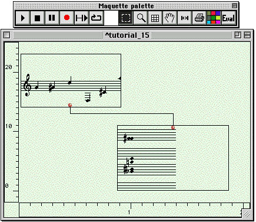
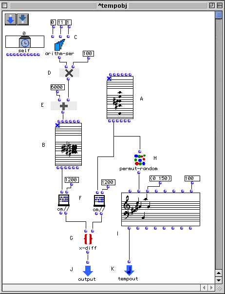
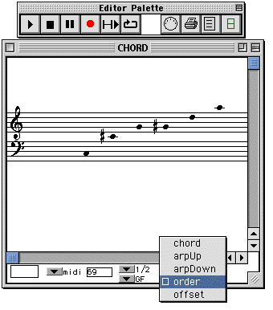
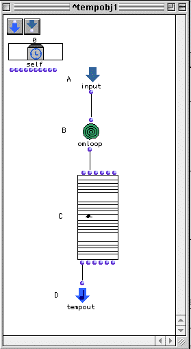
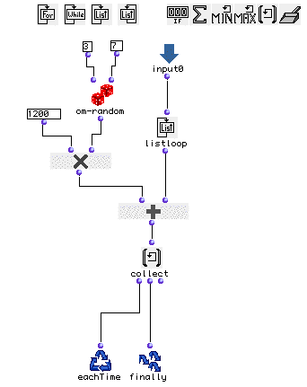
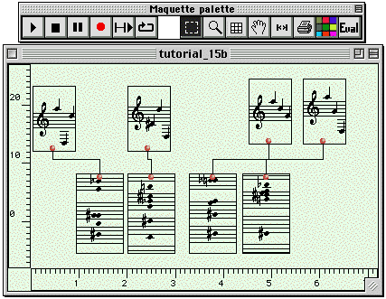

OpenMusic Tutorials  
---  
[Prev](tut.gen.32)| Chapter 11. The Maquette| [Next](tut.gen.34-35)  
  
* * *

# Tutorial 33: Introduction to the [**Maquette**](glossary#MAQUETTE) II

## Topics

Passing data between [**Temporalbox**](temporalbox) objects in a
[**Maquette**](glossary#MAQUETTE).

## Key Modules Used

[ **Maquette**](glossary#MAQUETTE), [**Temporalbox**](temporalbox),
[`om//`](omeucdivide), [`permut-random`](permut-random),
[`x-diff`](x-diff), [`omloop`](omloop)

## The Concept:

In this tutorial we will use two [**Temporalbox**](temporalbox)es, one
representing a six-note series randomly permuted at each evaluation, the other
representing a [**Chord**](chord). This [**Chord**](chord) will be
the chromatic complement of our series, and will be put into a random register
at each evaluation.

We can see that one [**Temporalbox**](temporalbox) depends on another
here. In order to accomplish this, we'll need to pass data about the series
from the one to the other in order that the complement can be constructed.

## The Patch:

Let's look inside the first [**Temporalbox**](temporalbox):

The [**Chord**](chord) at (A) represents our series, entered in the usual
way in order mode:

Note that the order of the series here is not important due to the fact that
we will randomly permute it.

In order to get the chromatic complement of our [**Chord**](chord) (A),
we build a chromatic scale that from which the notes of (A) will be
subtracted. In (B) we have constructed the total chromatic scale using
[`arithm-ser`](arithm-ser) (C) which outputs the list (0 1 2 3 4 5 6 8 9
10 11), which is multiplied by 100 to get midics. These intervals will all be
added to 6000 (middle C), returning (6000 6100 6200 etc... ) at (E).

The problem now is that our scale (B) going from 6000 to 7100 midics covers
only one octave. The [_pitch class_](glossary#PITCH-CLASS) C is
represented only by the midic 6000. If we compare it to a C in any other
octave, our patch will fail to recognize it as the same note in a different
register because they have different midics.

To get around this, we use [`om//`](omeucdivide), which performs
euclidian division (i.e. division with remainder) a number or list. The
quotient is returned at the first input and the remainder at the second. We
will divide everything by the octave in midics, 1200. In other words, we will
use a modulo 1200 on our scale by taking only the remainder of the note when
divided by 1200. All Cs are multiples of 1200. They will divide with a
remainder of 0. All Ds are 200 midics above a multiple of 1200 and will divide
with a remainder of 200. In this way we reduce both our chromatic scale and
the series to raw pitch class. (F)

The outputs of the two [`om//`](omeucdivide) boxes will be compared by
the [`x-diff`](x-diff) funtion which returns the list of elements present
in the first input but not in the second, therefore returning the notes of the
chromatic scale not found in our series, i.e. the complement. This result will
go out through an output added especially for this purpose at (J).

What actually gets played is a [**Chord-seq**](chord-seq) generated from
our series with the [`permut-random`](permut-random) function at (H). It
is passed to `tempout` so that it will play.

In the second [**Temporalbox**](temporalbox), we will add a random
multiple of 1200 to all the pitches retrieved from the first box via an input
specially added:

...and the interior of the [`omloop`](omloop):

...is pretty straightforward. The notes of the complementary chord are
enumerated one by one by [`listloop`](listloop). Each time, [`om-
random`](om-random) generates a number between 3 and 7 which is
multiplied by 1200 and added to the pitch, putting it in effect in a random
octave. The results are collected by [**collect**](listing) and output by
[`finally`](finaldo).

The output of the loop needs to be put into a playable musical object and
connected to the `tempout`. We chose a [**Chord**](chord), so they'll be
played simultaneously, but you can (and should) replace them with [**Chord-
seq**](chord-seq) objects.

Remember to click Eval before playing the
[**Maquette**](glossary#MAQUETTE). Remember also that you can copy boxes
by option-dragging them. In this way you can fill the
[**Maquette**](glossary#MAQUETTE) with random notes and chords:

* * *

[Prev](tut.gen.32)| [Home](index)| [Next](tut.gen.34-35)  
---|---|---  
Tutorial 32: Introduction to the [**Maquette**](glossary#MAQUETTE) I|
[Up](tut.gen.32-33)| Lambda Functions

