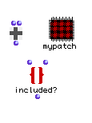
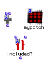
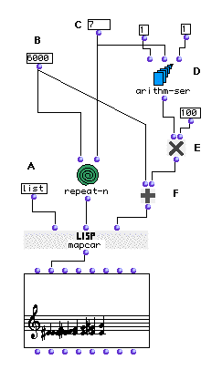
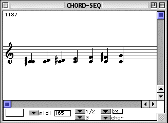
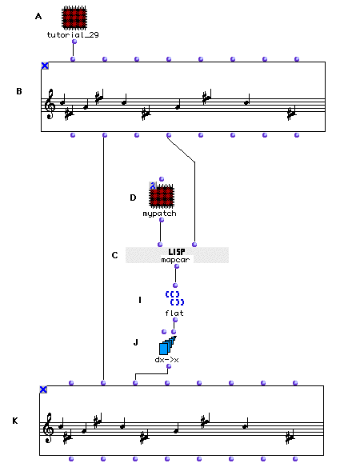
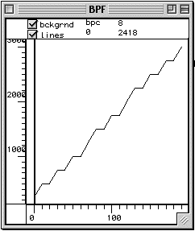
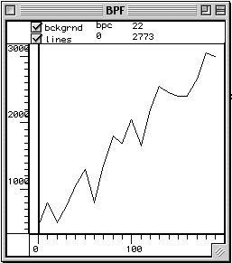
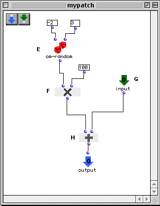

OpenMusic Tutorials  
---  
[Prev](tut.gen.34-35)| Chapter 12. Lambda Functions|
[Next](tut.gen.35)  
  
* * *

# Tutorial 34: Introduction to Lambda Functions

## Topics

The lambda mode for function boxes.

## Key Modules Used

[ mapcar ](mapcar), [ om-random ](om-random),
[ repeat-n ](repeat-n), [ arithm-ser ](arithm-ser),
[ dx->x ](dx-x)

## The Concept:

Patches and functions in OM have different states. We have already seen two of
them (the 'lock' state in [Tutorial_1](tut.gen.1) and the 'eval once'
state in [Tutorial 12](tut.gen.12) There are two others; here we
introduce the lambda state (λ). Any OM patch or function can be put in lambda
mode. This state is used whenever a function calls another function as an
argument, in order to apply this second function to some data. These are
generally standard LISP functions such as [ funcall ](funcall) or
[ mapcar ](mapcar). In this tutorial we'll look at two instances of their
use.

To put a patch in lambda state, bring up the 'lock' mark (an X) by selecting
it and hitting **b**. Then click the X representing the lock twice. The X
becomes a 1 and then a letter lambda, λ:

|
  
---|---  
  
Now let's look at our examples.

## The Patch:

### The first example

The [ mapcar ](mapcar) function takes as a first argument another
function and applies that function it to its other arguments. This called
function at the first argument can have any number of inputs. Since
[ mapcar ](mapcar) passes the elements of its inputs as arguments to this
called function, [ mapcar ](mapcar) must have as many additional inputs
as there are arguments of the called function. These inputs must themselves
take lists. [ mapcar ](mapcar) takes one element from each list and
passes the group to the elements of the called function. It does this with
each successive element of all the lists until the shortest list is exhausted,
collecting the results in a list.

You'll notice that we've typed the function name, [ list ](list), into
the box given as first input to [ mapcar ](mapcar). This works only for
LISP functions (functions whose icons are the word LISP). This is a shortcut;
we could have added a [ list ](list) box, put it in lambda mode, and
attached it.

In this patch we will construct a chromatic scale from C3 to G3 and add a C
pedal to it as shown below:

In terms of the patch, this pedal is added by putting each midic of the scale
into a list with the midic 6000 with the [ list ](list) function. It
would be tedious to perform the [ list ](list) function 7 times. It would
be more work to write an [ omloop ](omloop) to do this.
[ mapcar ](mapcar) does it all in one step. We give it a list of
chromatic midics and list of 6000s of the same length and tell it to apply the
[ list ](list) function to the pairs.

We use an [ arithm-ser ](arithm-ser) to create the scale and
[ repeat-n ](repeat-n) to create the list of 6000s. The results of the
[ mapcar ](mapcar) function are:

 ? OM->((6000 6100) (6000 6200) (6000 6300) (6000 6400) (6000 6500) (6000
6600) (6000 6700)) 

### The Second Example

Here we use the output of an abstraction of the patch from Tutorial 30 and
modify it. We will add some 'noise' to the onsets of the notes, in the form of
a small random quantity added to or subtracted from each duration, and turned
into a new onset. Again, this could be done with [ omloop ](omloop). It's
faster, however, to do it with [ mapcar ](mapcar). In this case, we want
to add a random value to each element of the  _ldur_  output of the [**Chord-
seq**](chord-seq).

So, we write a patch that will do this to a single number, and then send the
patch in lambda mode to [ mapcar ](mapcar), secure in the knowledge that
[ mapcar ](mapcar) will apply it once to each element of the list at its
other input(s). In this case we only need one input since we are modifying the
elements of just one list.

In Tutorial 30, an arithmetic series was turned into a list of durations. This
series is graphed here using a [**BPF**](editors.bpf#BPF):

Notice the more or less linear movement upward. (The roughness is a result of
the small number of data points.) What if we messed around with the values
just a little bit in a random way, generating a shape that, while still moving
up, is les linear:

We drag the patch Tutorial_30 into a new patch and make an abstraction of it
with **a** so that we don't screw up the original patch. We open it and add an
output, connecting it to the  _self_  output of the [**Voice**](voice)
factory.

In order to access durations from a [**Voice**](voice) object one must
use a [**Chord-seq**](chord-seq). Therefore, we will connect the output
of the Tutorial_30 patch to the first input of a [**Chord-seq**](chord-
seq) (B).

We build a red patch which takes an integer and adds a random value between
-200 and 300:

We need to convert these durations into onsets with [ dx->x ](dx-x), but
[ dx->x ](dx-x) only takes flat lists as input. So we use
[ flat ](flatlisp) to make it acceptable to [ dx->x ](dx-x) and pass
it to the  _lonset_  input of the [**Chord-seq**](chord-seq), using the
 _legato_  argument to make sure things sound goooood.

Evaluating this patch varies the onsets of the notes in a small random way
each time. Try evaluating it several times, listening to the results.

* * *

[Prev](tut.gen.34-35)| [Home](index)| [Next](tut.gen.35)  
---|---|---  
Lambda Functions| [Up](tut.gen.34-35)| Tutorial 35:
[ funcall ](funcall) with Lambda Functions

