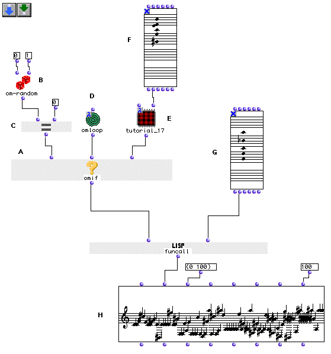
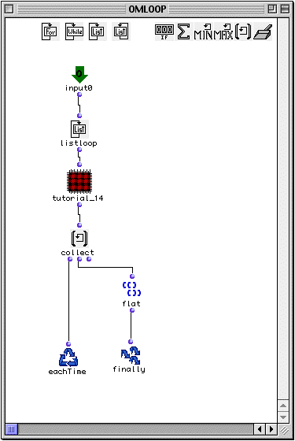
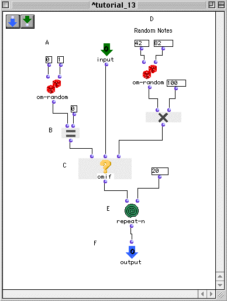
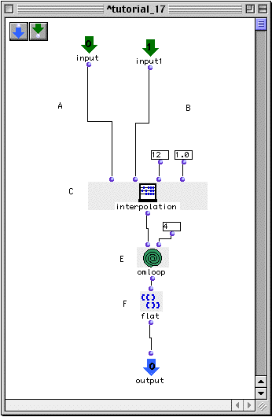

OpenMusic Tutorials  
---  
[Prev](tut.gen.34)| Chapter 12. Lambda Functions|
[Next](tut.gen.36-37)  
  
* * *

# Tutorial 35: [`funcall`](funcall) with Lambda Functions

## Topics

Calling a random function using [`funcall`](funcall).

## Key Modules Used

[`funcall`](funcall), [`omif`](omif), [`om-random`](om-random),
[`omloop`](omloop)

## The Concept:

[`funcall`](funcall) is like a single-shot version of
[`mapcar`](mapcar); it takes the lambda function at its first input and
passes it whatever comes in at the other inputs. Like [`mapcar`](mapcar),
it usually should have as many optional inputs as the lambda function it is
calling. [`funcall`](funcall) allows you to call a function as you would
evaluate any other data. Here, we use an [`omif`](omif) function with a
random outcome (thanks to [`om-random`](om-random) and the
[predicate](glossary#PREDICATE) [`om=`](omequal)) to send oneo of
two lambda functions to [`funcall`](funcall). Whichever one we choose,
[`funcall`](funcall) will apply it to the [**Chord**](chord) at (G).

## The Patch:

So, starting with [**Chord**](chord) (G), we will perform one of two
procedures on it. Either we will use it as a reservoir to construct a random
sequence of notes as in [Tutorial 14](tut.gen.14) or the interpolation
procedure of [Tutorial 18](tut.gen.18), which will interpolate a series
of notes between this [**Chord**](chord) and another.

Let's look at the loop at (D).

Inside is an abstraction of the patch from Tutorial 14, with an input and an
output added:

The result will be that the Tutorial 14 process is carried out for each note
of the chord.

The other possible function is an abstraction of the patch from Tutorial 18:

...modified to accept two [**Chord**](chord)s as input and perform the
interpolation process on them as outlined in [Tutorial 18](tut.gen.18).

|

Note that the second [**Chord**](chord) for the interpolation is coming
in from _outside_ the patch. This demonstrates that the functions in lambda
mode can still take data at their inputs, provided that the inputs are not
going to be acted upon by the [`funcall`](funcall) or whatever is calling
them. Remember how we said that [`funcall`](funcall) usually has to have
as many optional inputs as the function it is calling? Well, here is the
exception. Our [`funcall`](funcall) here has one optional input. (In
addition to the mandatory first input.) The abstraction has two inputs! But
[`funcall`](funcall) will only pass data to the first one since it was
only given one argument at its additional inputs. The leaves the second
argument of the abstration free; in fact, we _must_ pass something to it in
order for it to function correctly in lambda mode. Try disconnecting the
second input and see the error.  
  
---|---  
  
* * *

[Prev](tut.gen.34)| [Home](index)| [Next](tut.gen.36-37)  
---|---|---  
Tutorial 34: Introduction to Lambda Functions| [Up](tut.gen.34-35)| Flow
Control III: More Loops!

