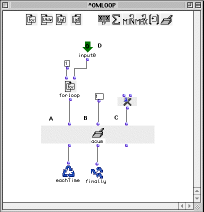

OpenMusic Tutorials  
---  
[Prev](tut.gen.36-37)| Chapter 13. Flow Control III: More Loops!|
[Next](tut.gen.37)  
  
* * *

# Tutorial 36: Accumulation

## Topics

Using [ acum ](accumulator) in the [ omloop ](omloop) module.

## Key Modules Used

[ omloop ](omloop)

## The Concept:

In this tutorial, we will examine a simple accumulative computation., that of
the factorial. The factorial operation is equivalent to taking the product of
an arithmetic series of integers ending at a given number. If is indicated
with an exclamation point. The factorial operation on a number is:

5! (5 factorial) = 1*2*3*4*5 = 120

In order to multiply the elements of the arithmetic series one after the
other, we need to hold the result of each multiplication somewhere until we
can use it in the next one. This is accomplished with
[ acum ](accumulator), which acts like a warehouse where you can store a
variable between iterations of a loop.

## The Patch:

We'll do two variants on the factorial procedure. In the first, we'll just go
for the final result. In the second, we'll program [ omloop ](omloop) to
return a list with the products of the intermediary operations.

The first loop looks like this:

The [ acum ](accumulator) collector takes three arguments. The second
input (B) is an initializer, which sets the internal state of the accumulator
before the first repetition of the loop. The third input (C) is a lambda
function (with two inputs) to which will be passed 1) whatever is coming into
the first input (A) and 2) the internal state of the accumulator. In our case
we'll use [ om* ](ommultiply) since we're interested in the product. The
result _becomes_ the internal state of the accumulator for the next pass. The
three outputs on the bottom work just like the other collectors.

The state of the loop through its repetitions is summarized:

Step| Listloop output| Value of the first input of accumulator| Value of the
second input of accumulator| Internal state (buffer)| Binary function  om* 
output  
---|---|---|---|---|---  
0| 1| 1| 1| 1| 1  
1| 2| 2| /| 1| 2  
2| 3| 3| /| 2| 6  
3| 4| 4| /| 6| 24  
4| 5| 5| /| 24| 120  
 |  |  |  | 120|  
  
The final state of the accumulator is available at the second output and
passed to [ finally ](finaldo).

As configured, the loop will output the final factorial when evaluated:

 ? OM->120 

If we want to see the intermediary steps, we need to record the internal state
of the accumulator at each repetition of the loop. This is done by adding a
[ collect ](listing) function and connecting it to the first input of the
accumulator, which returns the current internal state each time, which is
recorded in a list by [ collect ](listing).

The result:

 ? OM->(1 2 6 64 120) 

* * *

[Prev](tut.gen.36-37)| [Home](index)| [Next](tut.gen.37)  
---|---|---  
Flow Control III: More Loops!| [Up](tut.gen.36-37)| Tutorial 37:
Accumulation with musical objects

