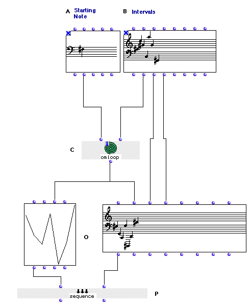
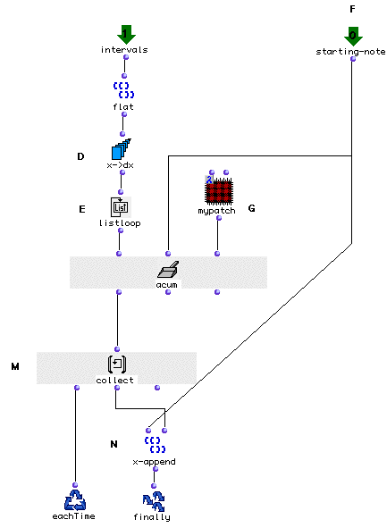
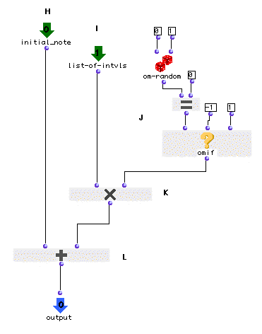

OpenMusic Tutorials  
---  
[Prev](tut.gen.36)| Chapter 13. Flow Control III: More Loops!|
[Next](tut.gen.38-39)  
  
* * *

# Tutorial 37: Accumulation with musical objects

## Topics

Given a starting note and a melodic sequence, construct a random sequence of
notes with the same intervals as the melodic sequence but random directions of
motion. Use of a lambda patch within [`omloop`](omloop) with
[`acum`](accumulator).

## Key Modules Used

[`omloop`](omloop), [**Note**](note), [**Chord-seq**](chord-
seq), [`x->dx`](x-dx), [`om-random`](om-random),
[`om=`](omequal), [`omif`](omif)

## The Concept:

Given a sequence of intervals (B) we will construct a musical sequence
starting from a given note (A). The intervals will be ordered as defined but
their direction (up or down) will be random (i.e ascending or descending
depending on [`om-random`](om-random)'s output). In order to do so we
will use an accumulative proceedure using [`omloop`](omloop)'s
[`acum`](accumulator) collector.

We will also demonstrate the [`sequence`](sequence) function by
simultaneously visualizing our new melodic figure using a
[**BPF**](editors.bpf#BPF) factory.

## The Patch:

The transformation of the sequence into a new one will be done in
[`omloop`](omloop) (C). This transformation is a transformation of pitch
only, so [`omloop`](omloop) (C) is connected to the second input of
[**Chord-seq**](chord-seq) (O). To get the rhythmic data we take the
`_ldur_` and `_lonset_` outputs of the [**Chord-seq**](chord-seq) (B) and
copy them directly.

[`omloop`](omloop) as shown above is in 'eval-once' mode. This is because
omloop is connected to two objects but contains a random function. We want to
make sure the same information is given to both the [**Chord-seq**](chord-
seq) and the [**BPF**](editors.bpf#BPF), which will not happen
unless we 'freeze' it after one evaluation.

Now let's look inside [`omloop`](omloop).

First of all we must convert the list of midics we will be receiving through
the `_intervals_` input into a list of relative intervals. This is done, as
usual, using [`x->dx`](x-dx). We must first use [`flat`](flatlisp)
since the `_lmidic_` output of the [**Chord-seq**](chord-seq) is a
[_nested_](glossary#NESTING) listand [`x->dx`](x-dx) needs a flat
list.

Each interval of the [**Chord-seq**](chord-seq) will thus be enumerated
individually and passed to our lambda patch (G) along with the results of the
previous calculation.

Here's the lambda patch:

The lambda patch (G) will take the initial note (H) and will add to it the
first interval (I). This interval will have been first multiplied either by 1
(which will leave it as is) or by -1 (which will invert the interval.)

In order to randomly invert the intervals we have used [`om-random`](om-
random). As we know, [`om-random`](om-random) returns random numbers
between limits set at its inputs. In our case we had to use a different
strategy because we are only interested in having -1 and 1. Simply using [`om-
random`](om-random) could have returned some zeroes. This is where
[`omif`](omif) comes in handy. We used [`om-random`](om-random) with
0 and 1 as arguments and connected it to the predicate [`om=`](omequal)in
order to transform each zero into a -1. If [`om-random`](om-random)
returns a zero, [`om=`](omequal) will return t and [`omif`](omif),
in turn, will return -1. If not, 1 is returned.

Once we have added our first interval (using [`om+`](omplus)) to the
initial note, the result will be a new note which will take the place of the
old as the internal state of our [`acum`](accumulator) collector. In
order to record each note we use [`collect`](listing), connected to the
first output of [`acum`](accumulator), as we did in the previous
tutorial.

Lastly, in order to have both factories (the [`BPF`](editors.bpf#BPF)
_and_ the [**Chord-seq**](chord-seq)) evaluated in a single evaluation we
will use [`sequence`](sequence). [`sequence`](sequence) evaluates
all its arguments sequentially, but you will only see one in the Listener. For
instance, if we evaluate the first output of [`sequence`](sequence) we
will obtain the [**BPF**](editors.bpf#BPF) object in the listener.
Evaluating the second output will return the [**Chord-seq**](chord-seq)
object. Both will be evaluated in the patch window, however.

* * *

[Prev](tut.gen.36)| [Home](index)| [Next](tut.gen.38-39)  
---|---|---  
Tutorial 36: Accumulation| [Up](tut.gen.36-37)| Flow Control IV:
Recursive Functions

