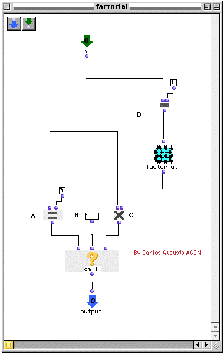
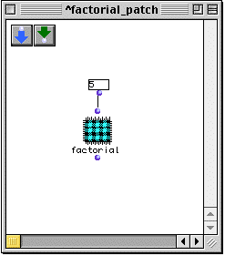

OpenMusic Tutorials  
---  
[Prev](tut.gen.38-39)| Chapter 14. Flow Control IV: Recursive Functions|
[Next](tut.gen.39)  
  
* * *

# Tutorial 38: Recursive patch I

## Topics

Introduces the concept of [_recursion_](glossary#RECURSIVITY)

## Key Modules Used

[ omif ](omif), [ omloop ](omloop), [ om= ](omequal),
[ om- ](omminus)

## The Concept:

As we have seen, OM patches can contain calls to functions, factories, etc.,
nested to any level we like. It is even possible to put a call to itself
within a function! A function which contains itself (created by dragging the
patch from the Workspace into the patch window itself) is called a recursive
function. Recursion is actually extremely useful and a powerful part of
[_object-oriented programming._](glossary#O-O-PROGRAMMING)

Some computations require recursive functions, while others benefit from the
clarity or speed of recursion, though they may be possible other ways. For
example, the factorial procedure performed in [Tutorial 36](tut.gen.36)
can be performed more elegantly (and more quickly, it turns out) using a
recursive function.

The scheme of the recursive function for finding 5! (5 factorial, that is the
product 1*2*3*4*5) for example, can be summarized:

  * First, we reverse our list: 5*4*3*2*1

  * 4 can be represented as (5-1). This means we start by mutiplying 5*(5-1).

  * 3 can be represented as ((5-1) -1 ). So we multiply 5*(5-1)*((5-1) -1)Get the idea?. 

  * The next level of recursion would be (((5-1) -1 ) -1), and so on, until we reach 1. 

We can imagine a function that multiplies 5 by a value taken from its last
repetition and passes that to itself along with the value to multiply by
(minus one). And here we run into a problem- since recursive functions call
themselves, they must have a built in 'brake' in the form of a termination
test. Only if the termination test fails should they call themselves. Without
a termination test, the function continues to call itself on into infinity,
eventually saturating the available memory and causing an error:

 > Error: Stack overflow on control stack. > To globally increase stack space,
> increase *minimum-stack-overflow-size* > While executing: "Unknown" > Type
Command-/ to continue, Command-. to abort. > If continued: Continue with a
larger stack See the Restarts menu item for further choices. 

Let's look at a recursive patch in OM which will calculate the factorial of
whatever number we give it:

## The Patch:

On the first repetition,  _n_  is equal to 5 (in our example.) If  _n_  is not
equal to zero, which it is not, [ om* ](ommultiply) is called to multiply
 _n_  and the result of the recursion into the patch  factorial . The trick is
that we subtract 1 from  _n_  before passing it to  factorial . Before
[ om* ](ommultiply) can complete, it must evaluate  factorial . So
factorial is evaluated using 4 for  _n_ . This recursion continues, going one
level deeper each time (like Russian dolls), until finally,  _n_  is zero. At
this point, [ omif ](omif) (the termination test at B) will return 1
instead of evaluating  factorial . 1 is passed to the output, which (remember
the Russian dolls?) is going to be coming into the [ om* ](ommultiply)
function in the level of recursion just above. In that level,  _n_  was equal
to 1. 1 times 1 is 1, which is passed to the output, which is itself the
second input to [ om* ](ommultiply) on the next level.  _n_  is 2 on this
level, and 2 times 1 is 2. Two is passed up out of that recursion to the next
level where  _n_  is 3. The product, 6, is passed, and we continue to work
back up, layer by layer, until we reach the top, where the product of
1*2*3*4*5, 120, is passed to the output.

To see this patch in action, drag it into any other patch.

Evaluate it with different numbers. Notice how it takes a longer time for big
numbers (since more levels of recursion are being created).

* * *

[Prev](tut.gen.38-39)| [Home](index)| [Next](tut.gen.39)  
---|---|---  
Flow Control IV: Recursive Functions| [Up](tut.gen.38-39)| Tutorial 39:
Recursive patch II

